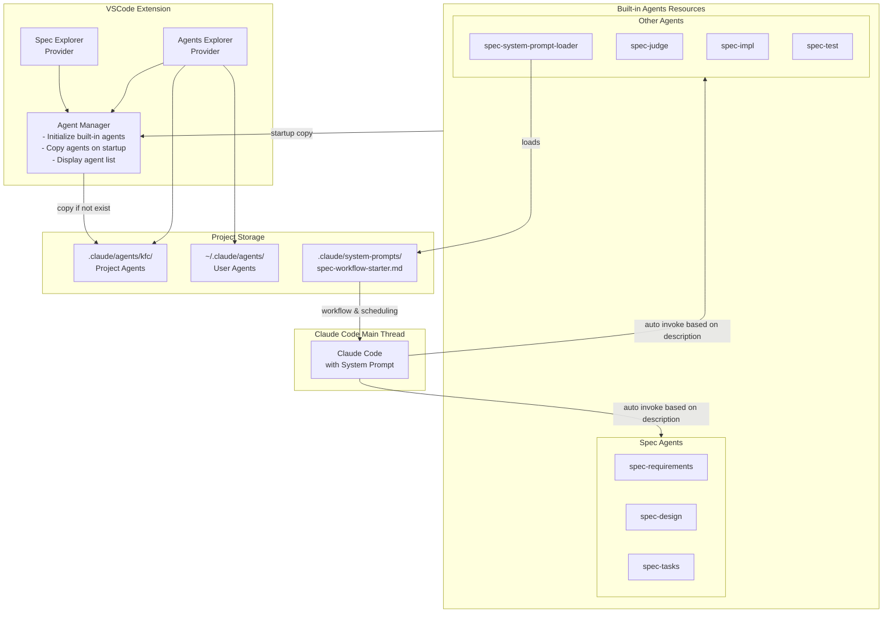

# 设计文档

## 概述

本设计文档描述了如何通过引入多个专门的 Claude Code subagent 来增强现有的 spec workflow 流程。该设计将创建三个核心 subagent（spec-requirements、spec-design、spec-tasks）以及相应的 VSCode 插件集成，实现并行处理和专业化管理。

## 架构

### 整体架构



### 组件间交互

1. **插件启动**：每次启动时检查 `.claude/agents/kfc/` 目录，如果内置 agents 不存在则复制
2. **Workflow 初始化**：spec-system-prompt-loader 加载 `.claude/system-prompts/spec-workflow-starter.md`，将调度策略和 spec workflow system prompt 提供给主线程
3. **Agent 管理**：Agent Manager 负责初始化和管理 agents，但不负责调用
4. **Subagent 调用**：Claude Code 主线程根据 system prompt 中的调度策略和 agent 描述自动识别并调用相应的 subagent
5. **UI 展示**：Agents Explorer 显示项目级和用户级 agents，允许用户查看和编辑

## 组件和接口

### 1. Agent Manager

```typescript
interface AgentManager {
  // 初始化内置 agents (启动时复制到 .claude/agents/kfc/)
  initializeBuiltInAgents(): Promise<void>;
  
  // 获取 agent 列表
  getAgentList(type: 'project' | 'user' | 'all'): Promise<AgentInfo[]>;
  
  // 检查 agent 是否存在
  checkAgentExists(agentName: string, location: 'project' | 'user'): boolean;
  
  // 获取 agent 文件路径
  getAgentPath(agentName: string): string | null;
}

interface AgentInfo {
  name: string;
  description: string;
  path: string;
  type: 'project' | 'user';
  tools?: string[];
}
```

### 2. Agents Explorer Provider

```typescript
class AgentsExplorerProvider extends vscode.TreeDataProvider<AgentItem> {
  constructor(
    private context: vscode.ExtensionContext,
    private agentManager: AgentManager
  );
  
  // 获取 agent 树形结构
  getChildren(element?: AgentItem): Promise<AgentItem[]>;
  
  // 刷新视图
  refresh(): void;
  
  // 打开 agent 文件
  openAgentFile(agentPath: string): Promise<void>;
}

class AgentItem extends vscode.TreeItem {
  constructor(
    public readonly label: string,
    public readonly agentInfo: AgentInfo,
    public readonly collapsibleState: vscode.TreeItemCollapsibleState
  );
}
```

### 3. 内置 Agents 初始化流程

```typescript
class AgentInitializer {
  private readonly BUILT_IN_AGENTS = [
    'spec-requirements',
    'spec-design', 
    'spec-tasks',
    'spec-system-prompt-loader',
    'spec-judge',
    'spec-impl',
    'spec-test'
  ];
  
  async initializeOnStartup(): Promise<void> {
    const targetDir = path.join(workspaceRoot, '.claude/agents/kfc');
    
    for (const agentName of this.BUILT_IN_AGENTS) {
      const targetPath = path.join(targetDir, `${agentName}.md`);
      
      // 如果文件不存在，则复制
      if (!fs.existsSync(targetPath)) {
        await this.copyBuiltInAgent(agentName, targetPath);
      }
    }
  }
  
  private async copyBuiltInAgent(agentName: string, targetPath: string): Promise<void> {
    const sourcePath = path.join(extensionPath, 'resources/agents', `${agentName}.md`);
    await fs.promises.copyFile(sourcePath, targetPath);
  }
}
```

### 4. 内置 Spec Subagents

内置的 spec subagents 已经过精心设计和测试，包括：

**核心 Spec Agents:**
- **spec-requirements**: 专门负责创建和优化 EARS 格式的需求文档
- **spec-design**: 基于需求文档创建详细的技术设计方案
- **spec-tasks**: 将设计转换为可执行的实施任务列表

**辅助 Agents:**
- **spec-system-prompt-loader**: 加载 `.claude/system-prompts/spec-workflow-starter.md`，为主线程提供 workflow 和调度策略
- **spec-judge**: 评审 spec 文档质量
- **spec-impl**: 执行具体的编码实施任务
- **spec-test**: 创建测试文档和测试代码

这些 agents 将在插件初始化时自动复制到项目的 `.claude/agents/kfc/` 目录。spec-system-prompt-loader 的加载使得主线程能够理解整个 spec workflow 并根据 agent 描述自动调度。

## 数据模型

### Agent 配置文件结构

```typescript
interface AgentConfig {
  // YAML frontmatter
  name: string;
  description: string;
  tools?: string[];
  
  // Markdown body
  systemPrompt: string;
}
```

### Agent 存储位置

- **项目级 agents**: `.claude/agents/kfc/*.md` (内置 agents 复制到此处)
- **用户级 agents**: `~/.claude/agents/*.md`
- **内置资源**: 扩展资源目录 `resources/agents/*.md`

## 错误处理

### 1. Agent 初始化错误

- **场景**：内置 agent 复制失败
- **处理**：记录错误到输出通道，跳过该文件，继续处理其他 agent

### 2. Agent 文件编辑确认

- **场景**：用户通过 Agents Explorer 修改 agent 文件
- **处理**：
  - 在屏幕中央显示确认弹框
  - 确认后保存更改
  - 取消则恢复原内容

### 3. Agent 文件缺失

- **场景**：用户删除了项目中的内置 agent 文件
- **处理**：
  - 下次启动时自动恢复
  - 提供手动恢复选项

## 测试策略

### 1. 单元测试

- **AgentManager**: 测试 agent 初始化、列表获取、文件操作
- **AgentsExplorerProvider**: 测试树形结构生成、事件处理
- **Subagent 协调**: 测试参数传递、结果处理

### 2. 集成测试

- **端到端工作流**: 测试完整的 spec 创建流程
- **并行执行**: 测试多个 subagent 同时工作
- **错误恢复**: 测试各种错误场景的处理

### 3. 用户验收测试

- **UI 交互**: 验证 Agents Explorer 的用户体验
- **性能测试**: 确保 subagent 调用不会阻塞 UI
- **兼容性测试**: 验证与现有 spec workflow 的兼容性

## 实施注意事项

1. **向后兼容**：新的 subagent 系统应与现有的 spec workflow 兼容
2. **性能优化**：使用缓存机制减少文件系统访问
3. **用户体验**：提供清晰的进度反馈和错误提示
4. **安全性**：限制 subagent 的工具权限，防止误操作
5. **可扩展性**：设计应支持未来添加更多类型的 subagent
6. **双入口支持**：Spec Explorer 应同时支持原有流程和新的 subagent 流程入口