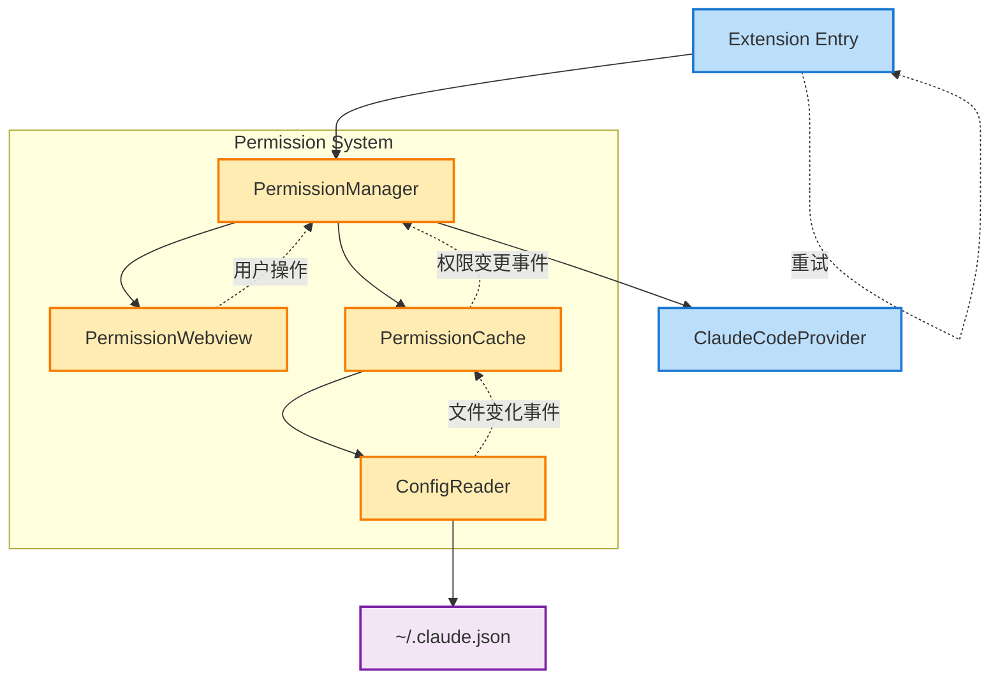
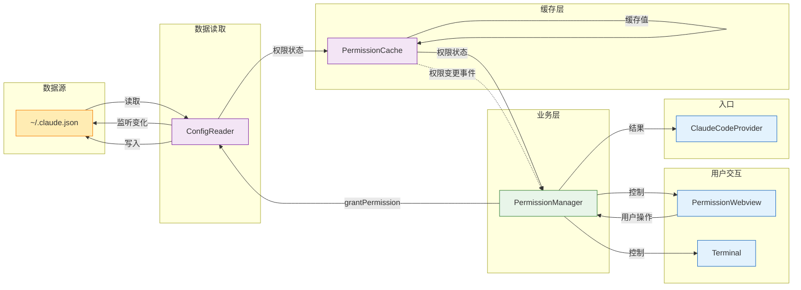
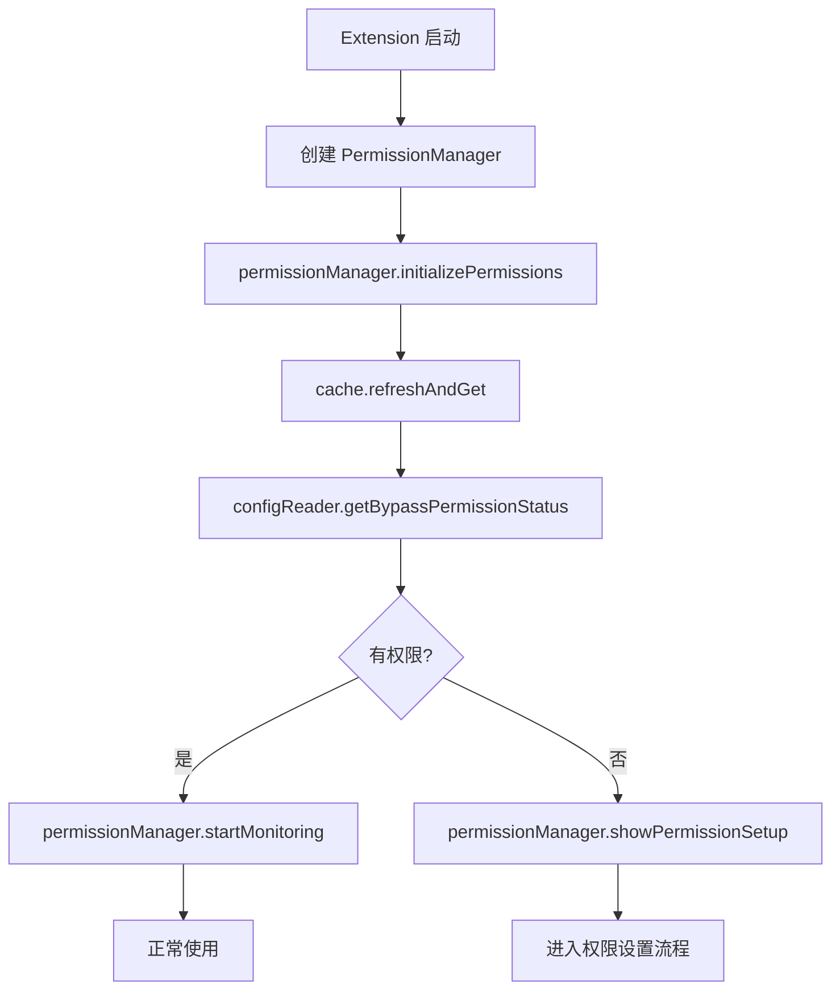
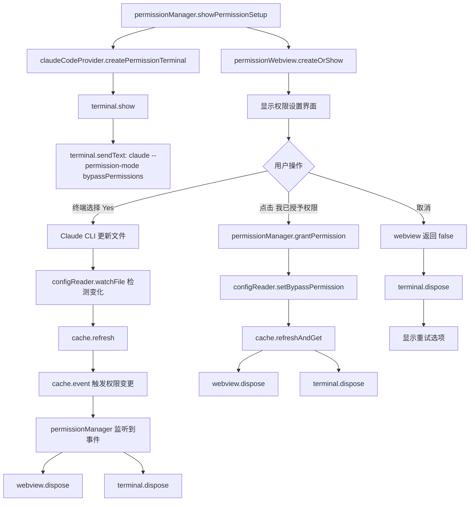
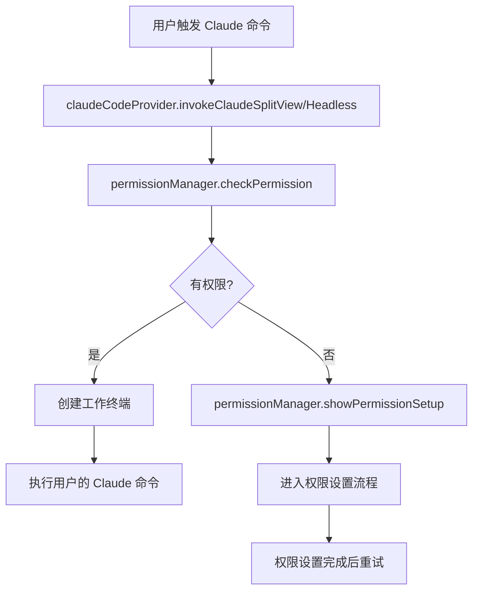
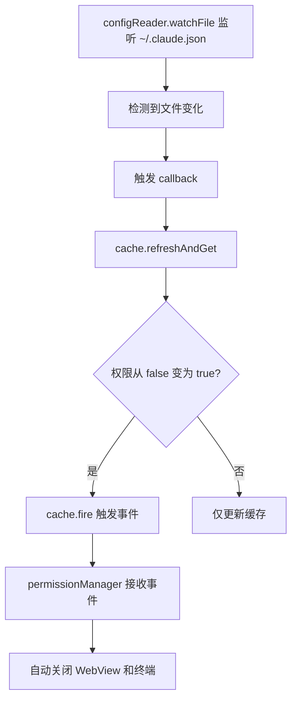
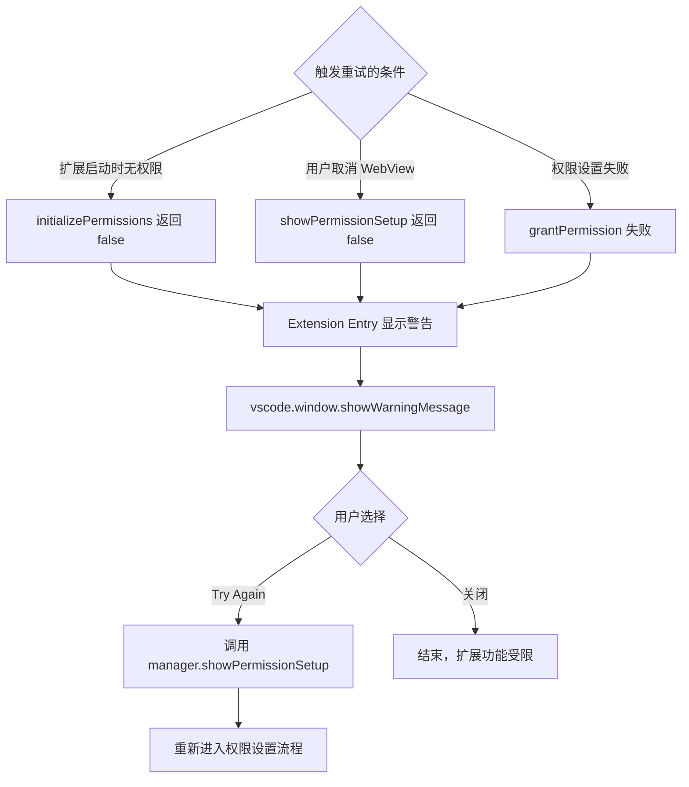

# 设计文档

## 概述

本设计文档描述了 Claude Code 权限验证系统的增强方案。现有系统依赖用户在 WebView 中点击确认，但没有验证权限是否真正生效。新系统将通过检查 `~/.claude.json` 配置文件中的 `bypassPermissionsModeAccepted` 字段来进行双向验证，确保权限真正被授予。

## 现有系统分析

### 当前实现

- **权限状态存储**: 使用 `context.globalState` 存储用户声明的状态
- **初始化流程**:
  1. 扩展启动时检查 globalState
  2. 如果没有权限记录，创建终端运行 `claude --permission-mode bypassPermissions`
  3. 显示 PermissionWebview 引导用户
  4. 用户点击"我已授予权限"后更新 globalState（但不验证实际状态）

### 存在的问题

1. 依赖用户诚实点击，没有实际验证
2. 无法感知权限被撤销的情况
3. 缺少错误处理和重试机制

## 增强架构

### 系统架构图



### 数据流图



### 核心组件设计

#### 1. PermissionManager（权限管理器）

- **职责**: Permission System 的中心协调器，管理整个权限流程
- **位置**: `src/features/permission/permissionManager.ts`
- **关键功能**:
  - 扩展启动时检查权限状态
  - 协调终端创建和 WebView 显示
  - 处理用户操作结果
  - 管理资源清理

```typescript
class PermissionManager {
  private permissionWebview?: vscode.WebviewPanel;
  private currentTerminal?: vscode.Terminal;
  private cache: IPermissionCache;
  private configReader: ConfigReader;
  
  constructor(
    private context: vscode.ExtensionContext,
    private outputChannel: vscode.OutputChannel
  ) {
    this.configReader = new ConfigReader(outputChannel);
    this.cache = new PermissionCache(this.configReader, outputChannel);
    
    // 监听权限变更事件
    this.cache.event((hasPermission) => {
      if (hasPermission && this.permissionWebview) {
        this.permissionWebview.dispose();
        NotificationUtils.showAutoDismissNotification('✅ Permission verified!');
      }
    });
  }
  
  // 扩展启动时调用，初始化权限系统
  async initializePermissions(): Promise<boolean>;
  
  // 运行时检查权限（使用缓存）
  async checkPermission(): Promise<boolean>;
  
  // WebView 点击"我已授予权限"时调用
  async grantPermission(): Promise<boolean>;
  
  // 显示权限设置流程（扩展启动和运行时都可能调用）
  async showPermissionSetup(): Promise<boolean>;
  
  startMonitoring(): void;
  dispose(): void;
}
```

#### 2. PermissionCache（权限缓存）

- **职责**: 管理权限状态的内存缓存，优化性能
- **位置**: `src/features/permission/permissionCache.ts`
- **关键功能**:
  - 缓存权限状态，避免频繁读文件
  - 发送权限变更事件
  - 缓存永不过期，除非文件变化

```typescript
interface IPermissionCache {
  get(): Promise<boolean>;
  refresh(): Promise<void>;
  refreshAndGet(): Promise<boolean>;
  readonly event: vscode.Event<boolean>;
}

class PermissionCache extends vscode.EventEmitter<boolean> implements IPermissionCache {
  private cache?: boolean;
  
  constructor(
    private configReader: ConfigReader,
    private outputChannel: vscode.OutputChannel
  ) {
    super();
  }
  
  async get(): Promise<boolean> {
    if (this.cache !== undefined) {
      return this.cache;
    }
    return this.refreshAndGet();
  }
  
  async refresh(): Promise<void> {
    await this.refreshAndGet();
  }
  
  async refreshAndGet(): Promise<boolean> {
    const oldValue = this.cache;
    this.cache = await this.configReader.getBypassPermissionStatus();
    
    // 权限从 false 变为 true 时触发事件
    if (oldValue === false && this.cache === true) {
      this.fire(true);
    }
    
    return this.cache;
  }
}
```

#### 3. ConfigReader（配置读取器）

- **职责**: 处理 `~/.claude.json` 文件的所有操作
- **位置**: `src/features/permission/configReader.ts`
- **关键功能**:
  - 读取配置文件
  - 写入权限设置
  - 监听文件变化

```typescript
class ConfigReader {
  private configPath = path.join(os.homedir(), '.claude.json');
  
  constructor(private outputChannel: vscode.OutputChannel) {}
  
  async getBypassPermissionStatus(): Promise<boolean> {
    try {
      if (!fs.existsSync(this.configPath)) {
        return false;
      }
      const content = await fs.promises.readFile(this.configPath, 'utf8');
      const config = JSON.parse(content);
      return config.bypassPermissionsModeAccepted === true;
    } catch (error) {
      this.outputChannel.appendLine(`[ConfigReader] Error: ${error}`);
      return false;
    }
  }
  
  async setBypassPermission(value: boolean): Promise<void>;
  watchConfigFile(callback: () => void): void;
  dispose(): void;
}
```

#### 4. PermissionWebview（权限设置界面）

- **职责**: 提供用户界面，收集用户操作
- **位置**: `src/webview/permissionWebview.ts`（现有组件）
- **改动说明**: 仅需微调，主要是增加 PermissionManager 参数
- **增强功能**:
  - 接收 PermissionManager 实例
  - 通过 Manager 处理用户操作
  - 不直接操作文件或状态

```typescript
export class PermissionWebviewProvider {
  public static currentPanel: vscode.WebviewPanel | undefined;
  
  public static createOrShow(
    context: vscode.ExtensionContext,
    permissionManager?: PermissionManager  // 新增参数
  ): Promise<boolean> {
    // 现有代码基本保持不变
    // 仅在处理 'accept' 消息时调用 permissionManager.grantPermission()
  }
}
```

#### 5. 集成方案说明

根据现有代码，重试机制已经在 Extension Entry 层实现，通过简单的递归调用实现。新的 Permission System 将保持这种简单的重试方式：

```typescript
// Extension Entry 中的重试逻辑
async function initializeExtension(context: vscode.ExtensionContext) {
  const permissionManager = new PermissionManager(context, outputChannel);
  
  const hasPermission = await permissionManager.initializePermissions();
  
  if (!hasPermission) {
    // 显示警告并提供重试选项
    vscode.window.showWarningMessage(
      'Claude Code permissions not granted. Some features may not work properly.',
      'Try Again'
    ).then(async selection => {
      if (selection === 'Try Again') {
        // 直接调用权限设置流程，而不是递归
        await permissionManager.showPermissionSetup();
      }
    });
  }
  
  // 保存 manager 供其他地方使用
  context.workspaceState.update('permissionManager', permissionManager);
}
```

这种设计保持了现有的简单性，无需额外的 RetryHandler 组件。

#### 6. ClaudeCodeProvider（增强现有组件）

- **职责**: 提供终端创建服务
- **位置**: `src/providers/claudeCodeProvider.ts`（现有组件）
- **改动说明**: 仅需添加一个静态方法，现有代码保持不变
- **新增方法**:

```typescript
class ClaudeCodeProvider {
  // 现有代码保持不变...
  
  // 仅新增此方法
  static createPermissionTerminal(): vscode.Terminal {
    const workspaceFolder = vscode.workspace.workspaceFolders?.[0]?.uri.fsPath;
    const terminal = vscode.window.createTerminal({
      name: 'Claude Code - Permission Setup',
      cwd: workspaceFolder,
      location: { viewColumn: vscode.ViewColumn.Two }
    });
    
    terminal.show();
    terminal.sendText(
      'claude --permission-mode bypassPermissions "Setting up Claude Code permissions..."',
      true
    );
    
    return terminal;
  }
}
```

### 数据模型

```typescript
// Claude 配置文件结构
interface ClaudeConfig {
  bypassPermissionsModeAccepted?: boolean;
  // 其他配置项...
}

// WebView 消息
interface PermissionWebviewMessage {
  command: 'accept' | 'cancel';
  data?: any;
}

// WebView 状态更新消息
interface WebviewStatusMessage {
  command: 'updateStatus';
  status: 'verifying' | 'failed' | 'success';
  message?: string;
}

// 文件变化事件数据
interface FileChangeEvent {
  configPath: string;
  previousMtime: Date;
  currentMtime: Date;
}
```

## 业务流程

### 1. 扩展启动时的权限检查



### 2. 权限设置流程



### 3. 执行 Claude 命令时的权限检查



### 4. 文件监听机制



### 5. 重试流程



**触发重试的具体场景**：

1. **扩展启动时检测到无权限**
   - `initializePermissions()` 返回 false
   - 用户在权限设置流程中取消

2. **用户在 WebView 中点击取消**
   - `showPermissionSetup()` 返回 false
   - 用户关闭了权限设置窗口

3. **权限设置失败**
   - 用户点击"我已授予权限"但验证失败
   - 文件写入失败等异常情况

4. **不会触发重试的情况**
   - 运行时权限检查失败（`checkPermission()` 返回 false）
   - 这种情况会直接调用 `showPermissionSetup()`，不走重试流程

## 集成方案

### 1. 简化 ClaudeCodeProvider

```typescript
export class ClaudeCodeProvider {
  private static permissionManager?: PermissionManager;
  
  static async initializePermissions(
    context: vscode.ExtensionContext, 
    outputChannel?: vscode.OutputChannel
  ): Promise<void> {
    // 创建权限管理器
    this.permissionManager = new PermissionManager(context, outputChannel);
    
    // 直接检查实际文件状态，不依赖 globalState
    const hasValidPermission = await this.permissionManager.initializePermissions();
    
    if (!hasValidPermission) {
      // 调用 PermissionManager 处理权限设置
      const userAccepted = await this.permissionManager.showPermissionSetup();
      
      if (userAccepted) {
        outputChannel?.appendLine('[ClaudeCodeProvider] Permission setup completed successfully');
        NotificationUtils.showAutoDismissNotification('✅ Claude Code permissions setup completed successfully!');
      } else {
        outputChannel?.appendLine('[ClaudeCodeProvider] User cancelled permission setup');
        
        const retry = await vscode.window.showWarningMessage(
          'Claude Code needs permissions to function properly.',
          'Try Again',
          'Cancel'
        );
        
        if (retry === 'Try Again') {
          // 递归调用重新开始
          await ClaudeCodeProvider.initializePermissions(context, outputChannel);
        }
      }
    } else {
      outputChannel?.appendLine(
        '[ClaudeCodeProvider] Permission already granted (verified from ~/.claude.json)'
      );
    }
    
    // 启动文件监听
    this.permissionManager.startMonitoring();
  }
  
  async invokeClaudeSplitView(prompt: string, options?: InvokeOptions) {
    // 检查权限（使用缓存）
    if (!await this.permissionManager.checkPermission()) {
      const granted = await this.permissionManager.showPermissionSetup();
      if (!granted) return;
    }
    
    // 继续原有逻辑
    // ...
  }
}
```

### 2. 简化 PermissionWebview

```typescript
export class PermissionWebviewProvider {
  private static verificationInProgress = false;
  
  public static createOrShow(
    context: vscode.ExtensionContext,
    permissionManager?: PermissionManager
  ): Promise<boolean> {
    // ... 现有代码 ...
    
    // 增强消息处理
    panel.webview.onDidReceiveMessage(async message => {
      switch (message.command) {
        case 'accept':
          // 触发验证
          if (permissionManager) {
            this.verificationInProgress = true;
            panel.webview.postMessage({ 
              command: 'updateStatus', 
              status: 'verifying' 
            });
            
            const isValid = await permissionManager.verifyAndUpdatePermission();
            
            if (isValid) {
              panel.dispose();
              resolve(true);
            } else {
              panel.webview.postMessage({ 
                command: 'updateStatus', 
                status: 'failed',
                message: '未检测到权限，请确保在终端中选择了 "Yes"'
              });
            }
            this.verificationInProgress = false;
          }
          break;
        // ... 其他处理 ...
      }
    });
  }
}
```

## 实现细节

### 事件驱动的权限变更

```typescript
// 1. PermissionCache 发起事件
class PermissionCache extends vscode.EventEmitter<boolean> implements IPermissionCache {
  private cache?: boolean;
  
  async refresh(): Promise<boolean> {
    const oldValue = this.cache;
    this.cache = await this.configReader.getBypassPermissionStatus();
    
    // 如果权限从 false 变为 true，触发事件
    if (oldValue === false && this.cache === true) {
      this.fire(true);
    }
    
    return this.cache;
  }
}

// 2. PermissionManager 监听权限变更
class PermissionManager {
  private permissionWebview?: vscode.WebviewPanel;
  private currentTerminal?: vscode.Terminal;
  
  constructor(/* ... */) {
    // 监听权限变更事件
    this.cache.event((hasPermission) => {
      if (hasPermission && this.permissionWebview) {
        // 自动关闭 WebView
        this.permissionWebview.dispose();
        this.permissionWebview = undefined;
        
        // 显示成功通知
        NotificationUtils.showAutoDismissNotification(
          '✅ Claude Code permissions detected and verified!'
        );
      }
    });
  }
  
  async showPermissionSetup(): Promise<boolean> {
    try {
      // 创建终端
      const workspaceFolder = vscode.workspace.workspaceFolders?.[0]?.uri.fsPath;
      this.currentTerminal = vscode.window.createTerminal({
        name: 'Claude Code - Permission Setup',
        cwd: workspaceFolder,
        location: { viewColumn: vscode.ViewColumn.Two }
      });
      
      this.currentTerminal.show();
      this.currentTerminal.sendText(
        'claude --permission-mode bypassPermissions "Setting up Claude Code permissions..."',
        true
      );
      
      // 创建 WebView 并保存引用
      const result = await PermissionWebviewProvider.createOrShow(
        this.context,
        this  // 传递 PermissionManager 实例
      );
      
      // 保存 WebView 引用以便事件驱动关闭
      this.permissionWebview = PermissionWebviewProvider.currentPanel;
      
      return result;
    } finally {
      // 清理终端
      if (this.currentTerminal) {
        this.currentTerminal.dispose();
        this.currentTerminal = undefined;
      }
    }
  }
  
  startMonitoring(): void {
    // 文件监听
    this.configReader.watchConfigFile(async () => {
      await this.cache.refresh();
    });
  }
}

// 3. WebView 通过 PermissionManager 修改文件
class PermissionWebviewProvider {
  public static createOrShow(
    context: vscode.ExtensionContext,
    permissionManager?: PermissionManager
  ): Promise<boolean> {
    // ... 现有代码 ...
    
    panel.webview.onDidReceiveMessage(async message => {
      switch (message.command) {
        case 'accept':
          // 用户点击"我已授予权限"
          if (permissionManager) {
            try {
              // 通过 PermissionManager 授予权限
              const success = await permissionManager.grantPermission();
              
              if (success) {
                // 关闭 WebView
                panel.dispose();
                resolve(true);
              } else {
                // 显示错误
                panel.webview.postMessage({ 
                  command: 'updateStatus', 
                  status: 'failed',
                  message: '无法设置权限，请重试'
                });
              }
            } catch (error) {
              // 显示错误
              panel.webview.postMessage({ 
                command: 'updateStatus', 
                status: 'failed',
                message: `设置权限失败: ${error.message}`
              });
            }
          } else {
            // 如果没有 permissionManager，回退到原有逻辑
            panel.dispose();
            resolve(true);
          }
          break;
        // ... 其他处理 ...
      }
    });
  }
}

// 4. PermissionManager 实现 grantPermission
class PermissionManager {
  async grantPermission(): Promise<boolean> {
    try {
      // 调用 ConfigReader 设置权限
      await this.configReader.setBypassPermission(true);
      
      // 刷新缓存
      await this.cache.refresh();
      
      // 记录日志
      this.outputChannel.appendLine(
        '[PermissionManager] Permission granted via WebView'
      );
      
      return true;
    } catch (error) {
      this.outputChannel.appendLine(
        `[PermissionManager] Failed to grant permission: ${error}`
      );
      return false;
    }
  }
}
```

### 权限验证流程

```typescript
class PermissionManager {
  async verifyAndUpdatePermission(): Promise<boolean> {
    try {
      // 1. 给用户一点时间完成终端操作
      await new Promise(resolve => setTimeout(resolve, 2000));
      
      // 2. 验证权限
      const result = await this.verifier.verify();
      
      if (result.hasPermission) {
        // 3. 清除内存缓存，强制下次读取最新状态
        this.invalidateCache();
        
        // 4. 记录成功
        this.outputChannel.appendLine(
          '[PermissionManager] Permission verified successfully'
        );
        
        return true;
      }
      
      // 5. 如果失败，提供详细信息
      this.outputChannel.appendLine(
        `[PermissionManager] Permission verification failed: ${JSON.stringify(result)}`
      );
      
      return false;
    } catch (error) {
      this.outputChannel.appendLine(`[PermissionManager] Verification error: ${error}`);
      return false;
    }
  }
}
```

### 文件操作实现

```typescript
class ConfigReader {
  private fileWatchInterval?: NodeJS.Timer;
  
  async setBypassPermission(value: boolean): Promise<void> {
    try {
      // 读取现有配置
      let config: any = {};
      if (fs.existsSync(this.configPath)) {
        const content = await fs.promises.readFile(this.configPath, 'utf8');
        try {
          config = JSON.parse(content);
        } catch (e) {
          // 如果解析失败，创建新配置
          config = {};
        }
      }
      
      // 设置权限字段
      config.bypassPermissionsModeAccepted = value;
      
      // 确保目录存在
      const dir = path.dirname(this.configPath);
      if (!fs.existsSync(dir)) {
        await fs.promises.mkdir(dir, { recursive: true });
      }
      
      // 写回文件
      await fs.promises.writeFile(
        this.configPath,
        JSON.stringify(config, null, 2),
        'utf8'
      );
      
      this.outputChannel.appendLine(
        `[ConfigReader] Set bypassPermissionsModeAccepted to ${value}`
      );
    } catch (error) {
      this.outputChannel.appendLine(
        `[ConfigReader] Failed to set permission: ${error}`
      );
      throw error;
    }
  }
  
  watchConfigFile(callback: () => void): void {
    // 使用 Node.js 的 fs.watchFile
    // 测试证明这是最可靠的方法
    fs.watchFile(this.configPath, { interval: 2000 }, (curr, prev) => {
      if (curr.mtime.getTime() !== prev.mtime.getTime()) {
        this.outputChannel.appendLine(
          `[ConfigReader] Detected change in ~/.claude.json`
        );
        callback();
      }
    });
  }
  
  dispose(): void {
    // 停止监听
    fs.unwatchFile(this.configPath);
  }
}
```

## 错误处理

### 错误场景

1. **配置文件不存在**: 引导用户初始化 Claude CLI
2. **权限字段为 false**: 显示详细的授权步骤
3. **文件读取失败**: 检查文件权限
4. **JSON 解析错误**: 提示文件损坏，建议重新初始化

### 用户友好的错误消息

```typescript
function getErrorMessage(result: PermissionCheckResult): string {
  if (!result.configExists) {
    return '未找到 Claude 配置文件。请先在终端运行 "claude" 命令进行初始化。';
  }
  
  if (!result.fieldExists) {
    return 'Claude 配置文件缺少权限字段。请重新运行权限设置流程。';
  }
  
  if (result.fieldValue === false) {
    return '权限未授予。请在终端中运行 Claude 命令并选择 "Yes, I accept"。';
  }
  
  if (result.error) {
    return `配置文件读取错误：${result.error}`;
  }
  
  return '未知错误，请查看输出日志。';
}
```

## 性能优化

1. **缓存策略**
   - 权限状态缓存 5 分钟
   - 文件变化时立即失效
   - 用户操作后立即刷新

2. **异步处理**
   - 权限检查不阻塞命令执行
   - 使用 Promise 处理所有 I/O 操作
   - 支持超时和取消

3. **资源管理**
   - 正确清理文件监听器
   - 限制重试次数
   - 合理的轮询间隔

## 状态管理策略

### 不使用 globalState 作为缓存

由于 `~/.claude.json` 文件可能随时被手动修改（用户编辑、其他工具修改等），我们：

1. **移除 globalState 依赖**：不再依赖 `kiroForClaudeCode.hasRunInitialPermission` 作为权限状态
2. **仅使用内存缓存**：短时间缓存（如 30 秒）以优化性能
3. **实时验证**：关键操作时总是验证实际文件状态

### 缓存策略

#### 缓存接口设计

```typescript
interface IPermissionCache {
  // 获取权限状态（首次调用时会读文件并缓存，之后直接返回缓存）
  get(): Promise<boolean>;
  
  // 读取文件并更新缓存（文件变化或需要强制验证时调用）
  refresh(): Promise<boolean>;
}

class PermissionCache implements IPermissionCache {
  private cache?: boolean;
  
  constructor(
    private configReader: ConfigReader,
    private outputChannel: vscode.OutputChannel
  ) {}
  
  async get(): Promise<boolean> {
    // 如果有缓存，直接返回
    if (this.cache !== undefined) {
      return this.cache;
    }
    
    // 首次调用，读取文件并缓存
    this.cache = await this.configReader.getBypassPermissionStatus();
    
    this.outputChannel.appendLine(
      `[PermissionCache] Initial load: ${this.cache}`
    );
    
    return this.cache;
  }
  
  async refresh(): Promise<boolean> {
    // 读取最新状态并更新缓存
    this.cache = await this.configReader.getBypassPermissionStatus();
    
    this.outputChannel.appendLine(
      `[PermissionCache] Refreshed: ${this.cache}`
    );
    
    return this.cache;
  }
}
```

#### PermissionManager 使用缓存

```typescript
class PermissionManager {
  private cache: IPermissionCache;
  
  constructor(/* ... */) {
    this.cache = new PermissionCache(this.configReader, this.outputChannel);
  }
  
  // 刷新并检查权限（扩展启动时使用）
  async refreshAndCheckPermission(): Promise<boolean> {
    return this.cache.refresh();
  }
  
  // 日常权限检查：使用缓存
  async checkPermission(): Promise<boolean> {
    return this.cache.get();
  }
  
  // 验证用户授权（用于权限设置流程）
  async verifyAndUpdatePermission(): Promise<boolean> {
    await new Promise(resolve => setTimeout(resolve, 2000));
    return this.cache.refresh();
  }
  
  // 文件变化时更新缓存
  async onFileChanged(): Promise<void> {
    await this.cache.refresh();
  }
}

## 测试计划

1. **单元测试**
   - Mock 文件系统操作
   - 测试各种权限状态
   - 验证缓存逻辑

2. **集成测试**
   - 完整的权限流程
   - WebView 交互
   - 错误恢复

3. **手动测试场景**
   - 首次安装
   - 权限撤销后恢复
   - 文件损坏处理
