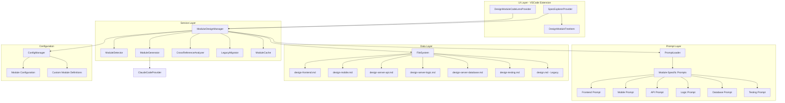
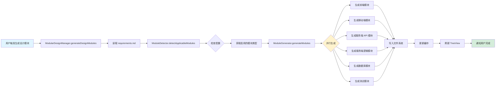
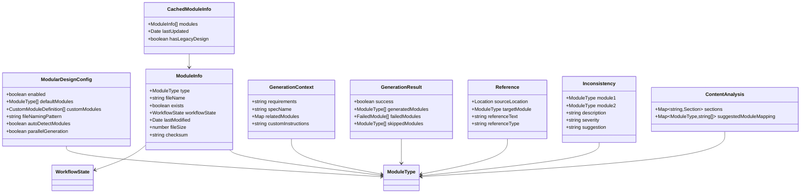
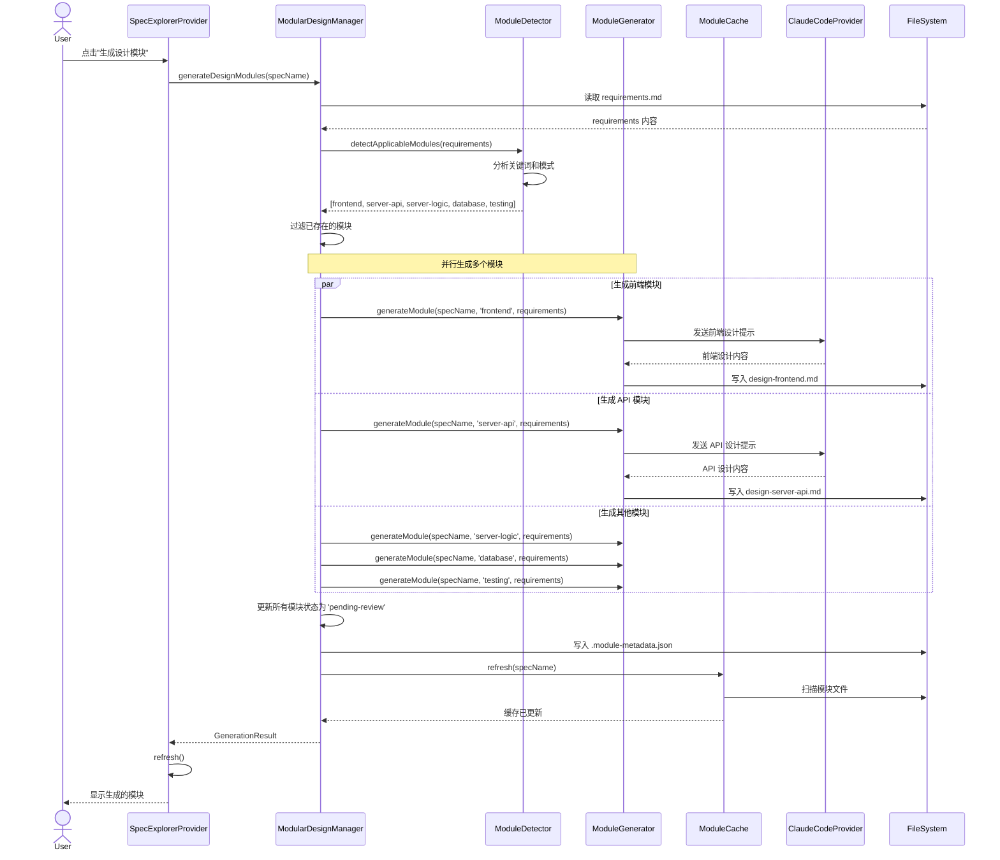
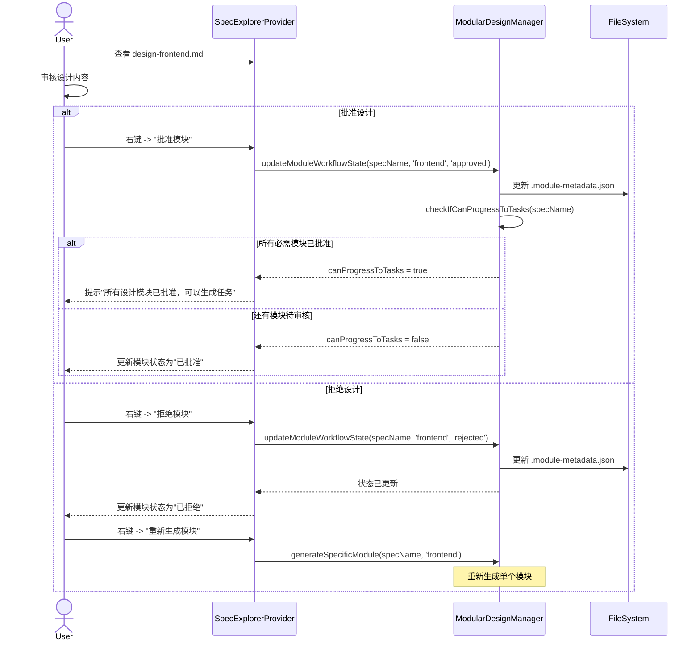
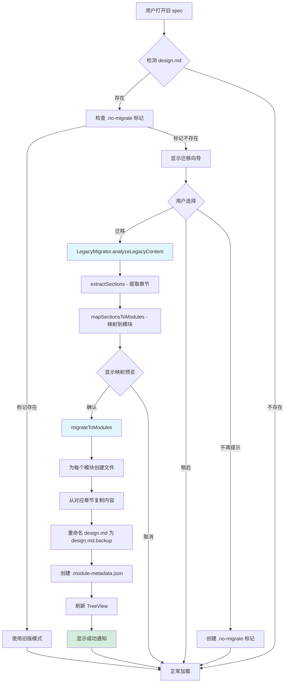
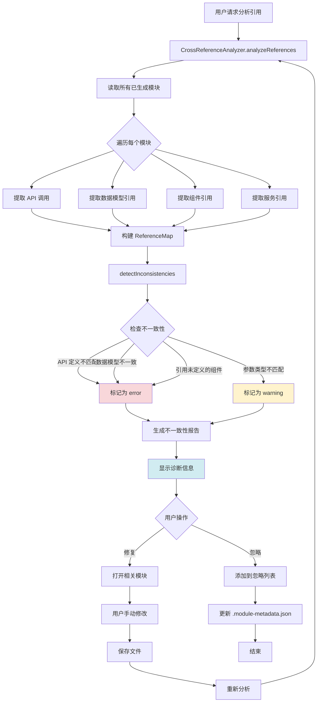
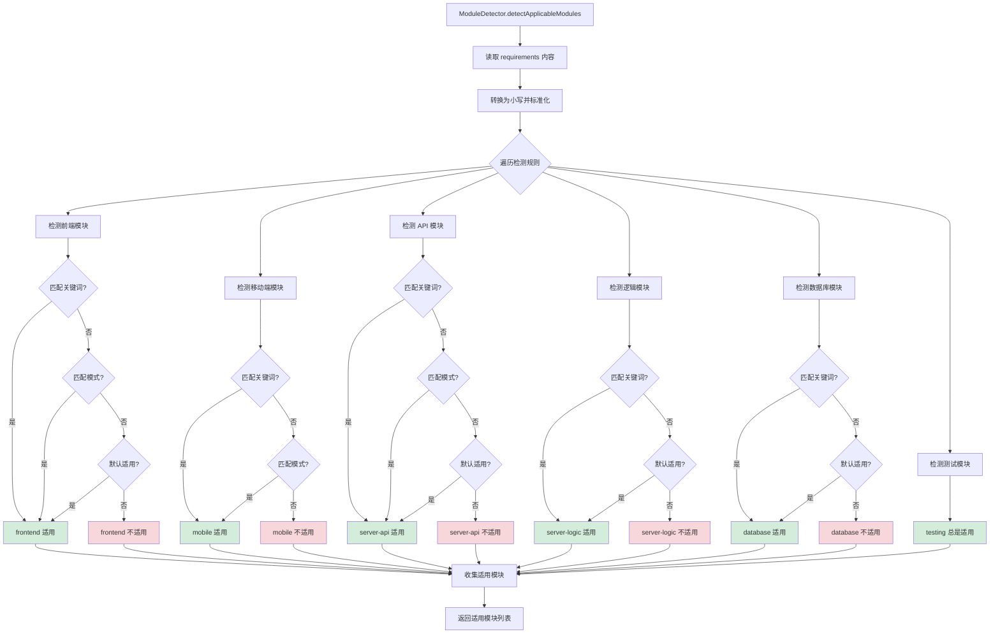
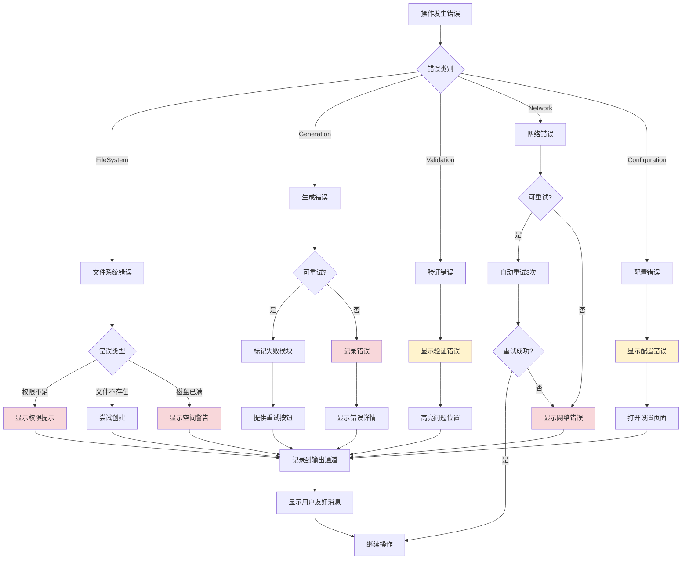

# 设计文档：模块化设计结构

## 概述

本设计文档详细说明了如何实现 Kiro for Claude Code 扩展的模块化设计结构功能。该功能将当前单一的 design.md 文件拆分为多个专门的设计模块，包括前端设计、移动端设计、服务端设计（API、逻辑、数据库模型）和测试用例。这种模块化结构将提高设计文档的可维护性、清晰度，并支持不同技术领域的并行开发。

### 设计目标

1. 将单一设计文档拆分为独立的、领域特定的模块
2. 支持向后兼容，保持现有 design.md 文件的正常工作
3. 提供智能模块检测，只生成相关的设计模块
4. 实现模块之间的交叉引用和一致性检查
5. 优化性能，支持并行生成和缓存机制
6. 提供灵活的配置选项，适应不同团队的需求

### 设计范围

- **包含**：模块文件结构、UI 导航、AI 提示模板、工作流状态管理、配置系统、性能优化
- **不包含**：实际的 AI 模型调整、Claude CLI 的底层实现、现有 spec 工作流的核心逻辑改动

## 架构设计

### 系统架构图



### 数据流图



## 组件设计

### 组件 A: ModularDesignManager

**职责：**
- 管理模块化设计的整个生命周期
- 协调模块的生成、更新、删除操作
- 处理向后兼容逻辑
- 管理模块状态和工作流

**接口：**

```typescript
interface IModularDesignManager {
    // 核心功能
    generateDesignModules(specName: string, options?: GenerateOptions): Promise<GenerationResult>;
    generateSpecificModule(specName: string, moduleType: ModuleType): Promise<void>;

    // 文件操作
    getModuleList(specName: string): Promise<ModuleInfo[]>;
    getModuleContent(specName: string, moduleType: ModuleType): Promise<string>;
    updateModule(specName: string, moduleType: ModuleType, content: string): Promise<void>;
    deleteModule(specName: string, moduleType: ModuleType): Promise<void>;

    // 向后兼容
    isLegacyDesign(specName: string): Promise<boolean>;
    migrateLegacyDesign(specName: string): Promise<MigrationResult>;

    // 工作流状态
    getModuleWorkflowState(specName: string, moduleType: ModuleType): Promise<WorkflowState>;
    updateModuleWorkflowState(specName: string, moduleType: ModuleType, state: WorkflowState): Promise<void>;
    canProgressToTasks(specName: string): Promise<boolean>;
}

interface GenerateOptions {
    moduleTypes?: ModuleType[];  // 如果指定，只生成这些模块
    forceRegenerate?: boolean;   // 强制重新生成已存在的模块
    parallel?: boolean;          // 是否并行生成（默认 true）
}

interface GenerationResult {
    success: boolean;
    generatedModules: ModuleType[];
    failedModules: Array<{ type: ModuleType; error: string }>;
    skippedModules: ModuleType[];  // 已存在或不适用的模块
}

interface ModuleInfo {
    type: ModuleType;
    fileName: string;
    exists: boolean;
    workflowState: WorkflowState;
    lastModified?: Date;
}

interface MigrationResult {
    success: boolean;
    migratedModules: ModuleType[];
    errors?: string[];
}

enum ModuleType {
    Frontend = 'frontend',
    Mobile = 'mobile',
    ServerApi = 'server-api',
    ServerLogic = 'server-logic',
    ServerDatabase = 'server-database',
    Testing = 'testing'
}

enum WorkflowState {
    NotGenerated = 'not-generated',
    PendingReview = 'pending-review',
    Approved = 'approved',
    Rejected = 'rejected'
}
```

**依赖：**
- `ModuleDetector` - 检测适用的模块
- `ModuleGenerator` - 生成模块内容
- `CrossReferenceAnalyzer` - 分析模块间引用
- `LegacyMigrator` - 迁移旧设计
- `ModuleCache` - 缓存模块信息
- `ConfigManager` - 读取配置
- `ClaudeCodeProvider` - 调用 Claude

**实现细节：**

```typescript
export class ModularDesignManager {
    private moduleCache: ModuleCache;
    private moduleDetector: ModuleDetector;
    private moduleGenerator: ModuleGenerator;
    private configManager: ConfigManager;

    constructor(
        private claudeProvider: ClaudeCodeProvider,
        private outputChannel: vscode.OutputChannel
    ) {
        this.configManager = ConfigManager.getInstance();
        this.moduleCache = new ModuleCache(outputChannel);
        this.moduleDetector = new ModuleDetector(outputChannel);
        this.moduleGenerator = new ModuleGenerator(claudeProvider, outputChannel);
    }

    async generateDesignModules(
        specName: string,
        options: GenerateOptions = {}
    ): Promise<GenerationResult> {
        const result: GenerationResult = {
            success: true,
            generatedModules: [],
            failedModules: [],
            skippedModules: []
        };

        try {
            // 1. 读取 requirements.md
            const requirements = await this.readRequirements(specName);

            // 2. 检测适用的模块
            let applicableModules: ModuleType[];
            if (options.moduleTypes) {
                applicableModules = options.moduleTypes;
            } else {
                applicableModules = await this.moduleDetector.detectApplicableModules(
                    requirements
                );
            }

            // 3. 过滤已存在的模块（除非强制重新生成）
            if (!options.forceRegenerate) {
                const existingModules = await this.getExistingModules(specName);
                applicableModules = applicableModules.filter(
                    type => !existingModules.includes(type)
                );
            }

            // 4. 生成模块
            if (options.parallel !== false && applicableModules.length > 1) {
                // 并行生成
                const results = await Promise.allSettled(
                    applicableModules.map(type =>
                        this.moduleGenerator.generateModule(specName, type, requirements)
                    )
                );

                results.forEach((res, index) => {
                    const moduleType = applicableModules[index];
                    if (res.status === 'fulfilled') {
                        result.generatedModules.push(moduleType);
                        // 设置为待审核状态
                        this.updateModuleWorkflowState(
                            specName,
                            moduleType,
                            WorkflowState.PendingReview
                        );
                    } else {
                        result.failedModules.push({
                            type: moduleType,
                            error: res.reason.message
                        });
                        result.success = false;
                    }
                });
            } else {
                // 串行生成
                for (const type of applicableModules) {
                    try {
                        await this.moduleGenerator.generateModule(
                            specName,
                            type,
                            requirements
                        );
                        result.generatedModules.push(type);
                        await this.updateModuleWorkflowState(
                            specName,
                            type,
                            WorkflowState.PendingReview
                        );
                    } catch (error) {
                        result.failedModules.push({
                            type,
                            error: (error as Error).message
                        });
                        result.success = false;
                    }
                }
            }

            // 5. 刷新缓存
            await this.moduleCache.refresh(specName);

            return result;

        } catch (error) {
            this.outputChannel.appendLine(
                `[ModularDesignManager] Generation failed: ${error}`
            );
            result.success = false;
            throw error;
        }
    }

    private async readRequirements(specName: string): Promise<string> {
        const specBasePath = await this.configManager.getSpecBasePath();
        const workspaceFolder = vscode.workspace.workspaceFolders?.[0];
        if (!workspaceFolder) {
            throw new Error('No workspace folder');
        }

        const reqPath = path.join(
            workspaceFolder.uri.fsPath,
            specBasePath,
            specName,
            'requirements.md'
        );

        const content = await vscode.workspace.fs.readFile(vscode.Uri.file(reqPath));
        return Buffer.from(content).toString();
    }

    private async getExistingModules(specName: string): Promise<ModuleType[]> {
        const moduleList = await this.getModuleList(specName);
        return moduleList.filter(m => m.exists).map(m => m.type);
    }
}
```

### 组件 B: ModuleDetector

**职责：**
- 分析需求文档，检测哪些设计模块适用
- 基于关键词和模式识别判断技术栈
- 支持自定义检测规则

**接口：**

```typescript
interface IModuleDetector {
    detectApplicableModules(requirements: string): Promise<ModuleType[]>;
    isModuleApplicable(requirements: string, moduleType: ModuleType): Promise<boolean>;
}
```

**实现细节：**

```typescript
export class ModuleDetector {
    private detectionRules: Map<ModuleType, DetectionRule>;

    constructor(private outputChannel: vscode.OutputChannel) {
        this.initializeDetectionRules();
    }

    private initializeDetectionRules() {
        this.detectionRules = new Map([
            [ModuleType.Frontend, {
                keywords: [
                    'frontend', 'web', 'ui', 'user interface', 'react', 'vue',
                    'angular', 'component', 'page', 'view', 'browser', 'html',
                    'css', 'javascript', 'typescript', 'webpack', '前端',
                    '界面', '网页', '组件'
                ],
                patterns: [
                    /web\s+application/i,
                    /user\s+interface/i,
                    /frontend\s+component/i
                ],
                defaultApplicable: true  // 默认适用
            }],
            [ModuleType.Mobile, {
                keywords: [
                    'mobile', 'ios', 'android', 'app', 'react native',
                    'flutter', 'native', 'phone', 'tablet', 'mobile app',
                    '移动端', '手机', 'APP'
                ],
                patterns: [
                    /mobile\s+app/i,
                    /(ios|android)\s+app/i
                ],
                defaultApplicable: false
            }],
            [ModuleType.ServerApi, {
                keywords: [
                    'api', 'endpoint', 'rest', 'graphql', 'http', 'request',
                    'response', 'server', 'backend', 'route', 'controller',
                    '接口', '后端', '服务端'
                ],
                patterns: [
                    /api\s+endpoint/i,
                    /rest\s+api/i,
                    /backend\s+api/i
                ],
                defaultApplicable: true
            }],
            [ModuleType.ServerLogic, {
                keywords: [
                    'business logic', 'service', 'backend', 'server',
                    'processing', 'calculation', 'workflow', 'algorithm',
                    '业务逻辑', '服务层', '处理'
                ],
                patterns: [
                    /business\s+logic/i,
                    /service\s+layer/i
                ],
                defaultApplicable: true
            }],
            [ModuleType.ServerDatabase, {
                keywords: [
                    'database', 'db', 'sql', 'nosql', 'mongodb', 'postgresql',
                    'mysql', 'redis', 'model', 'schema', 'entity', 'table',
                    'collection', '数据库', '数据模型', '表'
                ],
                patterns: [
                    /database\s+schema/i,
                    /data\s+model/i,
                    /(sql|nosql)\s+database/i
                ],
                defaultApplicable: true
            }],
            [ModuleType.Testing, {
                keywords: [
                    'test', 'testing', 'qa', 'quality', 'unit test',
                    'integration test', 'e2e', 'jest', 'mocha', 'cypress',
                    '测试', '单元测试', '集成测试'
                ],
                patterns: [
                    /test\s+case/i,
                    /testing\s+strategy/i
                ],
                defaultApplicable: true  // 测试总是适用
            }]
        ]);
    }

    async detectApplicableModules(requirements: string): Promise<ModuleType[]> {
        const applicable: ModuleType[] = [];
        const normalizedReq = requirements.toLowerCase();

        for (const [moduleType, rule] of this.detectionRules) {
            let isApplicable = rule.defaultApplicable;

            // 检查关键词
            const hasKeyword = rule.keywords.some(keyword =>
                normalizedReq.includes(keyword.toLowerCase())
            );

            // 检查模式
            const hasPattern = rule.patterns.some(pattern =>
                pattern.test(requirements)
            );

            if (hasKeyword || hasPattern) {
                isApplicable = true;
            }

            if (isApplicable) {
                applicable.push(moduleType);
                this.outputChannel.appendLine(
                    `[ModuleDetector] Module ${moduleType} is applicable`
                );
            }
        }

        return applicable;
    }

    async isModuleApplicable(
        requirements: string,
        moduleType: ModuleType
    ): Promise<boolean> {
        const applicable = await this.detectApplicableModules(requirements);
        return applicable.includes(moduleType);
    }
}

interface DetectionRule {
    keywords: string[];
    patterns: RegExp[];
    defaultApplicable: boolean;
}
```

### 组件 C: ModuleGenerator

**职责：**
- 使用 Claude 生成特定模块的设计内容
- 管理模块特定的提示模板
- 处理生成失败和重试逻辑

**接口：**

```typescript
interface IModuleGenerator {
    generateModule(specName: string, moduleType: ModuleType, requirements: string): Promise<void>;
    getModulePrompt(moduleType: ModuleType, context: GenerationContext): string;
}

interface GenerationContext {
    requirements: string;
    specName: string;
    relatedModules?: Map<ModuleType, string>;  // 已生成的相关模块内容
    customInstructions?: string;
}
```

**依赖：**
- `PromptLoader` - 加载提示模板
- `ClaudeCodeProvider` - 调用 Claude API
- `CrossReferenceAnalyzer` - 提取交叉引用信息

### 组件 D: CrossReferenceAnalyzer

**职责：**
- 分析模块间的交叉引用
- 检测模块间的不一致性
- 生成模块间的链接和引用

**接口：**

```typescript
interface ICrossReferenceAnalyzer {
    analyzeReferences(modules: Map<ModuleType, string>): ReferenceMap;
    detectInconsistencies(modules: Map<ModuleType, string>): Inconsistency[];
    generateCrossLinks(moduleType: ModuleType, modules: Map<ModuleType, string>): CrossLink[];
}

interface ReferenceMap {
    [sourceModule: string]: {
        [targetModule: string]: Reference[];
    };
}

interface Reference {
    sourceLocation: Location;
    targetModule: ModuleType;
    referenceText: string;
    referenceType: 'api-call' | 'data-model' | 'component' | 'service' | 'test-target';
}

interface Inconsistency {
    module1: ModuleType;
    module2: ModuleType;
    description: string;
    severity: 'error' | 'warning';
    suggestion?: string;
}

interface CrossLink {
    targetModule: ModuleType;
    linkText: string;
    reason: string;
}
```

### 组件 E: LegacyMigrator

**职责：**
- 检测旧的 design.md 文件
- 智能拆分内容到相应模块
- 提供迁移向导和用户确认

**接口：**

```typescript
interface ILegacyMigrator {
    detectLegacyDesign(specName: string): Promise<boolean>;
    analyzeLegacyContent(content: string): ContentAnalysis;
    migrateToModules(specName: string, analysis: ContentAnalysis): Promise<MigrationResult>;
    showMigrationWizard(specName: string): Promise<boolean>;  // 返回用户是否确认迁移
}

interface ContentAnalysis {
    sections: Map<string, Section>;
    suggestedModuleMapping: Map<ModuleType, string[]>;  // 模块类型 -> 章节名列表
}

interface Section {
    title: string;
    content: string;
    startLine: number;
    endLine: number;
    suggestedModule: ModuleType;
    confidence: number;  // 0-1 的置信度
}
```

**实现细节：**

```typescript
export class LegacyMigrator {
    constructor(private outputChannel: vscode.OutputChannel) {}

    async detectLegacyDesign(specName: string): Promise<boolean> {
        const configManager = ConfigManager.getInstance();
        const specBasePath = await configManager.getSpecBasePath();
        const workspaceFolder = vscode.workspace.workspaceFolders?.[0];

        if (!workspaceFolder) {
            return false;
        }

        const legacyPath = path.join(
            workspaceFolder.uri.fsPath,
            specBasePath,
            specName,
            'design.md'
        );

        try {
            await vscode.workspace.fs.stat(vscode.Uri.file(legacyPath));
            return true;
        } catch {
            return false;
        }
    }

    analyzeLegacyContent(content: string): ContentAnalysis {
        const sections = this.extractSections(content);
        const suggestedModuleMapping = this.mapSectionsToModules(sections);

        return {
            sections,
            suggestedModuleMapping
        };
    }

    private extractSections(content: string): Map<string, Section> {
        const sections = new Map<string, Section>();
        const lines = content.split('\n');
        let currentSection: Section | null = null;
        let currentContent: string[] = [];
        let startLine = 0;

        lines.forEach((line, index) => {
            // 检测标题 (## 或 ###)
            const headerMatch = line.match(/^(#{2,3})\s+(.+)$/);

            if (headerMatch) {
                // 保存上一个章节
                if (currentSection) {
                    currentSection.content = currentContent.join('\n');
                    currentSection.endLine = index - 1;
                    sections.set(currentSection.title, currentSection);
                }

                // 开始新章节
                const title = headerMatch[2];
                currentSection = {
                    title,
                    content: '',
                    startLine: index,
                    endLine: index,
                    suggestedModule: this.guessModuleFromTitle(title),
                    confidence: 0.7
                };
                currentContent = [];
                startLine = index;
            } else if (currentSection) {
                currentContent.push(line);
            }
        });

        // 保存最后一个章节
        if (currentSection) {
            currentSection.content = currentContent.join('\n');
            currentSection.endLine = lines.length - 1;
            sections.set(currentSection.title, currentSection);
        }

        return sections;
    }

    private guessModuleFromTitle(title: string): ModuleType {
        const lowerTitle = title.toLowerCase();

        if (lowerTitle.includes('frontend') ||
            lowerTitle.includes('ui') ||
            lowerTitle.includes('component')) {
            return ModuleType.Frontend;
        }

        if (lowerTitle.includes('mobile') ||
            lowerTitle.includes('ios') ||
            lowerTitle.includes('android')) {
            return ModuleType.Mobile;
        }

        if (lowerTitle.includes('api') ||
            lowerTitle.includes('endpoint') ||
            lowerTitle.includes('rest')) {
            return ModuleType.ServerApi;
        }

        if (lowerTitle.includes('database') ||
            lowerTitle.includes('model') ||
            lowerTitle.includes('schema')) {
            return ModuleType.ServerDatabase;
        }

        if (lowerTitle.includes('test') ||
            lowerTitle.includes('testing')) {
            return ModuleType.Testing;
        }

        // 默认为服务端逻辑
        return ModuleType.ServerLogic;
    }

    private mapSectionsToModules(
        sections: Map<string, Section>
    ): Map<ModuleType, string[]> {
        const mapping = new Map<ModuleType, string[]>();

        for (const [title, section] of sections) {
            const moduleType = section.suggestedModule;

            if (!mapping.has(moduleType)) {
                mapping.set(moduleType, []);
            }

            mapping.get(moduleType)!.push(title);
        }

        return mapping;
    }

    async showMigrationWizard(specName: string): Promise<boolean> {
        const message = `检测到 "${specName}" 使用旧的设计文档格式。是否要迁移到新的模块化结构？`;

        const choice = await vscode.window.showInformationMessage(
            message,
            { modal: true },
            '迁移',
            '稍后',
            '不再提示'
        );

        if (choice === '迁移') {
            return true;
        }

        if (choice === '不再提示') {
            // 在 spec 目录下创建 .no-migrate 标记文件
            await this.createNoMigrateMarker(specName);
        }

        return false;
    }

    private async createNoMigrateMarker(specName: string): Promise<void> {
        const configManager = ConfigManager.getInstance();
        const specBasePath = await configManager.getSpecBasePath();
        const workspaceFolder = vscode.workspace.workspaceFolders?.[0];

        if (!workspaceFolder) {
            return;
        }

        const markerPath = path.join(
            workspaceFolder.uri.fsPath,
            specBasePath,
            specName,
            '.no-migrate'
        );

        await vscode.workspace.fs.writeFile(
            vscode.Uri.file(markerPath),
            Buffer.from('')
        );
    }
}
```

### 组件 F: ModuleCache

**职责：**
- 缓存模块列表和状态信息
- 减少文件系统操作
- 提供快速的模块信息查询

**接口：**

```typescript
interface IModuleCache {
    get(specName: string): Promise<CachedModuleInfo | null>;
    set(specName: string, info: CachedModuleInfo): Promise<void>;
    refresh(specName: string): Promise<CachedModuleInfo>;
    clear(specName?: string): void;
    invalidate(specName: string): void;
}

interface CachedModuleInfo {
    modules: ModuleInfo[];
    lastUpdated: Date;
    hasLegacyDesign: boolean;
}
```

**实现细节：**

```typescript
export class ModuleCache {
    private cache: Map<string, CachedModuleInfo>;
    private readonly CACHE_TTL = 5 * 60 * 1000; // 5分钟

    constructor(private outputChannel: vscode.OutputChannel) {
        this.cache = new Map();
    }

    async get(specName: string): Promise<CachedModuleInfo | null> {
        const cached = this.cache.get(specName);

        if (!cached) {
            return null;
        }

        // 检查缓存是否过期
        const age = Date.now() - cached.lastUpdated.getTime();
        if (age > this.CACHE_TTL) {
            this.outputChannel.appendLine(
                `[ModuleCache] Cache expired for ${specName}`
            );
            this.cache.delete(specName);
            return null;
        }

        return cached;
    }

    async set(specName: string, info: CachedModuleInfo): Promise<void> {
        this.cache.set(specName, {
            ...info,
            lastUpdated: new Date()
        });
    }

    async refresh(specName: string): Promise<CachedModuleInfo> {
        // 从文件系统读取实际状态
        const modules = await this.scanModulesFromFileSystem(specName);
        const hasLegacyDesign = await this.checkLegacyDesign(specName);

        const info: CachedModuleInfo = {
            modules,
            lastUpdated: new Date(),
            hasLegacyDesign
        };

        await this.set(specName, info);
        return info;
    }

    clear(specName?: string): void {
        if (specName) {
            this.cache.delete(specName);
        } else {
            this.cache.clear();
        }
    }

    invalidate(specName: string): void {
        this.cache.delete(specName);
    }

    private async scanModulesFromFileSystem(specName: string): Promise<ModuleInfo[]> {
        const configManager = ConfigManager.getInstance();
        const specBasePath = await configManager.getSpecBasePath();
        const workspaceFolder = vscode.workspace.workspaceFolders?.[0];

        if (!workspaceFolder) {
            return [];
        }

        const specPath = path.join(
            workspaceFolder.uri.fsPath,
            specBasePath,
            specName
        );

        const moduleInfos: ModuleInfo[] = [];

        for (const moduleType of Object.values(ModuleType)) {
            const fileName = `design-${moduleType}.md`;
            const filePath = path.join(specPath, fileName);

            let exists = false;
            let lastModified: Date | undefined;

            try {
                const stat = await vscode.workspace.fs.stat(vscode.Uri.file(filePath));
                exists = true;
                lastModified = new Date(stat.mtime);
            } catch {
                // 文件不存在
            }

            moduleInfos.push({
                type: moduleType as ModuleType,
                fileName,
                exists,
                workflowState: WorkflowState.NotGenerated,  // 将从元数据文件读取实际状态
                lastModified
            });
        }

        return moduleInfos;
    }

    private async checkLegacyDesign(specName: string): Promise<boolean> {
        const configManager = ConfigManager.getInstance();
        const specBasePath = await configManager.getSpecBasePath();
        const workspaceFolder = vscode.workspace.workspaceFolders?.[0];

        if (!workspaceFolder) {
            return false;
        }

        const legacyPath = path.join(
            workspaceFolder.uri.fsPath,
            specBasePath,
            specName,
            'design.md'
        );

        try {
            await vscode.workspace.fs.stat(vscode.Uri.file(legacyPath));
            return true;
        } catch {
            return false;
        }
    }
}
```

### 组件 G: SpecExplorerProvider（扩展）

**职责：**
- 在 TreeView 中显示设计模块
- 支持模块的展开/折叠
- 显示模块状态图标
- 提供上下文菜单操作

**接口扩展：**

```typescript
// 扩展现有的 SpecExplorerProvider
class SpecExplorerProvider {
    // 新增方法
    private async getDesignModuleChildren(specItem: SpecItem): Promise<SpecItem[]>;
    private getModuleIcon(moduleInfo: ModuleInfo): vscode.ThemeIcon;
}
```

**实现细节：**

在 `getChildren` 方法中，当处理 `spec` 类型的元素时，需要检查是否启用了模块化设计：

```typescript
async getChildren(element?: SpecItem): Promise<SpecItem[]> {
    if (element?.contextValue === 'spec') {
        const configManager = ConfigManager.getInstance();
        const settings = await configManager.loadSettings();

        // 检查是否启用模块化设计
        if (settings.features?.modularDesign?.enabled) {
            return this.getModularDesignChildren(element);
        } else {
            return this.getLegacyDesignChildren(element);
        }
    }
    // ... 其他逻辑
}

private async getModularDesignChildren(specItem: SpecItem): Promise<SpecItem[]> {
    const children: SpecItem[] = [];

    // Requirements 文档
    children.push(new SpecItem(
        'requirements',
        vscode.TreeItemCollapsibleState.None,
        'spec-document-requirements',
        this.context,
        specItem.specName,
        'requirements',
        {
            command: 'kfc.spec.navigate.requirements',
            title: 'Open Requirements',
            arguments: [specItem.specName]
        }
    ));

    // Design Modules 节点（可展开）
    const designModulesItem = new SpecItem(
        'design modules',
        vscode.TreeItemCollapsibleState.Expanded,
        'spec-design-modules',
        this.context,
        specItem.specName
    );
    designModulesItem.iconPath = new vscode.ThemeIcon('layers');
    children.push(designModulesItem);

    // Tasks 文档
    children.push(new SpecItem(
        'tasks',
        vscode.TreeItemCollapsibleState.None,
        'spec-document-tasks',
        this.context,
        specItem.specName,
        'tasks',
        {
            command: 'kfc.spec.navigate.tasks',
            title: 'Open Tasks',
            arguments: [specItem.specName]
        }
    ));

    return children;
}

private async getDesignModuleChildren(parentItem: SpecItem): Promise<SpecItem[]> {
    const modularDesignManager = new ModularDesignManager(
        this.claudeProvider,
        this.outputChannel
    );

    const moduleList = await modularDesignManager.getModuleList(
        parentItem.specName!
    );

    return moduleList.map(moduleInfo => {
        const label = this.getModuleLabel(moduleInfo.type);
        const icon = this.getModuleIcon(moduleInfo);

        const item = new SpecItem(
            label,
            vscode.TreeItemCollapsibleState.None,
            `spec-design-module-${moduleInfo.type}`,
            this.context,
            parentItem.specName,
            `design-${moduleInfo.type}`,
            {
                command: 'kfc.spec.navigate.designModule',
                title: `Open ${label}`,
                arguments: [parentItem.specName, moduleInfo.type]
            }
        );

        item.iconPath = icon;
        item.tooltip = this.getModuleTooltip(moduleInfo);

        return item;
    });
}

private getModuleLabel(moduleType: ModuleType): string {
    const labels: Record<ModuleType, string> = {
        [ModuleType.Frontend]: '前端设计',
        [ModuleType.Mobile]: '移动端设计',
        [ModuleType.ServerApi]: '服务端 API',
        [ModuleType.ServerLogic]: '服务端逻辑',
        [ModuleType.ServerDatabase]: '数据库设计',
        [ModuleType.Testing]: '测试设计'
    };
    return labels[moduleType];
}

private getModuleIcon(moduleInfo: ModuleInfo): vscode.ThemeIcon {
    if (!moduleInfo.exists) {
        return new vscode.ThemeIcon('file-add',
            new vscode.ThemeColor('editorWarning.foreground'));
    }

    switch (moduleInfo.workflowState) {
        case WorkflowState.PendingReview:
            return new vscode.ThemeIcon('eye',
                new vscode.ThemeColor('editorInfo.foreground'));
        case WorkflowState.Approved:
            return new vscode.ThemeIcon('check',
                new vscode.ThemeColor('editorInfo.foreground'));
        case WorkflowState.Rejected:
            return new vscode.ThemeIcon('close',
                new vscode.ThemeColor('editorError.foreground'));
        default:
            return new vscode.ThemeIcon('file');
    }
}

private getModuleTooltip(moduleInfo: ModuleInfo): string {
    if (!moduleInfo.exists) {
        return '模块尚未生成';
    }

    let tooltip = `状态: ${this.getWorkflowStateLabel(moduleInfo.workflowState)}`;
    if (moduleInfo.lastModified) {
        tooltip += `\n最后修改: ${moduleInfo.lastModified.toLocaleString()}`;
    }

    return tooltip;
}

private getWorkflowStateLabel(state: WorkflowState): string {
    const labels: Record<WorkflowState, string> = {
        [WorkflowState.NotGenerated]: '未生成',
        [WorkflowState.PendingReview]: '待审核',
        [WorkflowState.Approved]: '已批准',
        [WorkflowState.Rejected]: '已拒绝'
    };
    return labels[state];
}
```

## 数据模型

### 核心数据结构定义

```typescript
// ============================================================================
// 模块类型定义
// ============================================================================

/**
 * 设计模块类型枚举
 */
enum ModuleType {
    Frontend = 'frontend',
    Mobile = 'mobile',
    ServerApi = 'server-api',
    ServerLogic = 'server-logic',
    ServerDatabase = 'server-database',
    Testing = 'testing'
}

/**
 * 模块工作流状态
 */
enum WorkflowState {
    NotGenerated = 'not-generated',
    PendingReview = 'pending-review',
    Approved = 'approved',
    Rejected = 'rejected'
}

// ============================================================================
// 模块配置
// ============================================================================

/**
 * 模块化设计配置
 */
interface ModularDesignConfig {
    enabled: boolean;
    defaultModules: ModuleType[];
    customModules?: CustomModuleDefinition[];
    fileNamingPattern?: string;  // 默认: "design-{moduleType}.md"
    autoDetectModules?: boolean;  // 默认: true
    parallelGeneration?: boolean;  // 默认: true
    cacheEnabled?: boolean;  // 默认: true
    cacheTTL?: number;  // 默认: 300000 (5分钟)
}

/**
 * 自定义模块定义
 */
interface CustomModuleDefinition {
    type: string;  // 自定义模块类型标识
    name: string;  // 显示名称
    fileName: string;  // 文件名
    promptTemplate?: string;  // 自定义提示模板
    detectionRules?: DetectionRule;  // 检测规则
    icon?: string;  // VSCode ThemeIcon 名称
}

// ============================================================================
// 模块信息
// ============================================================================

/**
 * 模块信息
 */
interface ModuleInfo {
    type: ModuleType;
    fileName: string;
    exists: boolean;
    workflowState: WorkflowState;
    lastModified?: Date;
    fileSize?: number;
    checksum?: string;  // 用于检测内容变化
}

/**
 * 缓存的模块信息
 */
interface CachedModuleInfo {
    modules: ModuleInfo[];
    lastUpdated: Date;
    hasLegacyDesign: boolean;
}

// ============================================================================
// 生成相关
// ============================================================================

/**
 * 模块生成选项
 */
interface GenerateOptions {
    moduleTypes?: ModuleType[];
    forceRegenerate?: boolean;
    parallel?: boolean;
    includeRelatedModules?: boolean;  // 生成时是否包含相关模块内容作为上下文
}

/**
 * 生成结果
 */
interface GenerationResult {
    success: boolean;
    generatedModules: ModuleType[];
    failedModules: Array<{
        type: ModuleType;
        error: string;
    }>;
    skippedModules: ModuleType[];
}

/**
 * 生成上下文
 */
interface GenerationContext {
    requirements: string;
    specName: string;
    relatedModules?: Map<ModuleType, string>;
    customInstructions?: string;
}

// ============================================================================
// 交叉引用
// ============================================================================

/**
 * 引用映射
 */
interface ReferenceMap {
    [sourceModule: string]: {
        [targetModule: string]: Reference[];
    };
}

/**
 * 引用
 */
interface Reference {
    sourceLocation: Location;
    targetModule: ModuleType;
    referenceText: string;
    referenceType: 'api-call' | 'data-model' | 'component' | 'service' | 'test-target';
}

/**
 * 位置信息
 */
interface Location {
    line: number;
    column: number;
    fileName: string;
}

/**
 * 不一致性
 */
interface Inconsistency {
    module1: ModuleType;
    module2: ModuleType;
    description: string;
    severity: 'error' | 'warning';
    suggestion?: string;
}

/**
 * 交叉链接
 */
interface CrossLink {
    targetModule: ModuleType;
    linkText: string;
    reason: string;
}

// ============================================================================
// 迁移相关
// ============================================================================

/**
 * 内容分析
 */
interface ContentAnalysis {
    sections: Map<string, Section>;
    suggestedModuleMapping: Map<ModuleType, string[]>;
}

/**
 * 章节
 */
interface Section {
    title: string;
    content: string;
    startLine: number;
    endLine: number;
    suggestedModule: ModuleType;
    confidence: number;  // 0-1
}

/**
 * 迁移结果
 */
interface MigrationResult {
    success: boolean;
    migratedModules: ModuleType[];
    errors?: string[];
}

// ============================================================================
// 检测规则
// ============================================================================

/**
 * 检测规则
 */
interface DetectionRule {
    keywords: string[];
    patterns: RegExp[];
    defaultApplicable: boolean;
}
```

### 数据模型图



### 文件系统结构

```
.claude/
└── specs/
    └── {spec-name}/
        ├── requirements.md              # 需求文档
        ├── design.md                    # 旧版设计文档（向后兼容）
        ├── design-frontend.md           # 前端设计模块
        ├── design-mobile.md             # 移动端设计模块
        ├── design-server-api.md         # 服务端 API 设计模块
        ├── design-server-logic.md       # 服务端逻辑设计模块
        ├── design-server-database.md    # 数据库设计模块
        ├── design-testing.md            # 测试设计模块
        ├── tasks.md                     # 任务文档
        ├── .module-metadata.json        # 模块元数据（工作流状态等）
        └── .no-migrate                  # 不迁移标记文件
```

### 模块元数据文件结构

`.module-metadata.json` 文件用于存储模块的工作流状态和其他元数据：

```json
{
  "version": "1.0",
  "modules": {
    "frontend": {
      "workflowState": "approved",
      "generatedAt": "2025-10-14T10:30:00Z",
      "approvedAt": "2025-10-14T11:00:00Z",
      "approvedBy": "user",
      "checksum": "abc123..."
    },
    "server-api": {
      "workflowState": "pending-review",
      "generatedAt": "2025-10-14T10:35:00Z",
      "checksum": "def456..."
    },
    "testing": {
      "workflowState": "not-generated"
    }
  },
  "canProgressToTasks": false
}
```

## 业务流程

### 流程 1: 生成所有设计模块



### 流程 2: 审核和批准单个模块



### 流程 3: 迁移旧版设计文档



### 流程 4: 跨模块引用分析



### 流程 5: 智能模块检测



## 错误处理策略

### 错误分类

```typescript
enum ErrorCategory {
    FileSystem = 'filesystem',
    Generation = 'generation',
    Validation = 'validation',
    Network = 'network',
    Configuration = 'configuration'
}

interface ErrorContext {
    category: ErrorCategory;
    operation: string;
    specName?: string;
    moduleType?: ModuleType;
    retryable: boolean;
    userMessage: string;
    technicalDetails: string;
}
```

### 错误处理流程



### 错误处理实现

```typescript
export class ErrorHandler {
    constructor(private outputChannel: vscode.OutputChannel) {}

    async handleError(error: Error, context: Partial<ErrorContext>): Promise<void> {
        const errorContext = this.buildErrorContext(error, context);

        // 记录技术细节
        this.logError(errorContext);

        // 显示用户友好消息
        await this.showUserMessage(errorContext);

        // 根据错误类型采取特定行动
        await this.handleSpecificError(errorContext);
    }

    private buildErrorContext(
        error: Error,
        context: Partial<ErrorContext>
    ): ErrorContext {
        return {
            category: context.category || this.detectErrorCategory(error),
            operation: context.operation || 'unknown',
            specName: context.specName,
            moduleType: context.moduleType,
            retryable: context.retryable ?? this.isRetryable(error),
            userMessage: context.userMessage || this.getUserMessage(error),
            technicalDetails: error.stack || error.message
        };
    }

    private detectErrorCategory(error: Error): ErrorCategory {
        const message = error.message.toLowerCase();

        if (message.includes('enoent') || message.includes('eacces')) {
            return ErrorCategory.FileSystem;
        }
        if (message.includes('timeout') || message.includes('network')) {
            return ErrorCategory.Network;
        }
        if (message.includes('validation') || message.includes('invalid')) {
            return ErrorCategory.Validation;
        }
        if (message.includes('config')) {
            return ErrorCategory.Configuration;
        }

        return ErrorCategory.Generation;
    }

    private isRetryable(error: Error): boolean {
        const message = error.message.toLowerCase();
        return message.includes('timeout') ||
               message.includes('network') ||
               message.includes('temporary');
    }

    private getUserMessage(error: Error): string {
        const message = error.message.toLowerCase();

        if (message.includes('enoent')) {
            return '文件或目录不存在';
        }
        if (message.includes('eacces')) {
            return '权限不足，无法访问文件';
        }
        if (message.includes('timeout')) {
            return '操作超时，请重试';
        }
        if (message.includes('network')) {
            return '网络连接失败';
        }

        return '操作失败';
    }

    private logError(context: ErrorContext): void {
        this.outputChannel.appendLine('');
        this.outputChannel.appendLine('='.repeat(80));
        this.outputChannel.appendLine(`[ERROR] ${context.category.toUpperCase()}`);
        this.outputChannel.appendLine(`Operation: ${context.operation}`);
        if (context.specName) {
            this.outputChannel.appendLine(`Spec: ${context.specName}`);
        }
        if (context.moduleType) {
            this.outputChannel.appendLine(`Module: ${context.moduleType}`);
        }
        this.outputChannel.appendLine(`Retryable: ${context.retryable}`);
        this.outputChannel.appendLine(`Message: ${context.userMessage}`);
        this.outputChannel.appendLine('Technical Details:');
        this.outputChannel.appendLine(context.technicalDetails);
        this.outputChannel.appendLine('='.repeat(80));
    }

    private async showUserMessage(context: ErrorContext): Promise<void> {
        const message = `${context.userMessage} (${context.operation})`;

        if (context.retryable) {
            const choice = await vscode.window.showErrorMessage(
                message,
                '重试',
                '查看日志'
            );

            if (choice === '查看日志') {
                this.outputChannel.show();
            }
            // 重试逻辑由调用方处理
        } else {
            const choice = await vscode.window.showErrorMessage(
                message,
                '查看日志'
            );

            if (choice === '查看日志') {
                this.outputChannel.show();
            }
        }
    }

    private async handleSpecificError(context: ErrorContext): Promise<void> {
        switch (context.category) {
            case ErrorCategory.FileSystem:
                await this.handleFileSystemError(context);
                break;
            case ErrorCategory.Configuration:
                await this.handleConfigurationError(context);
                break;
            // 其他类别的特定处理
        }
    }

    private async handleFileSystemError(context: ErrorContext): Promise<void> {
        if (context.technicalDetails.includes('EACCES')) {
            vscode.window.showWarningMessage(
                '请检查文件权限设置',
                '打开文件位置'
            ).then(choice => {
                if (choice && context.specName) {
                    // 打开文件所在目录
                }
            });
        }
    }

    private async handleConfigurationError(context: ErrorContext): Promise<void> {
        const choice = await vscode.window.showErrorMessage(
            '配置错误',
            '打开设置'
        );

        if (choice === '打开设置') {
            vscode.commands.executeCommand('kfc.settings.open');
        }
    }
}
```

### 重试机制

```typescript
export class RetryHandler {
    private readonly MAX_RETRIES = 3;
    private readonly RETRY_DELAY = 1000; // 毫秒

    async withRetry<T>(
        operation: () => Promise<T>,
        context: string,
        retryable: boolean = true
    ): Promise<T> {
        let lastError: Error | null = null;
        let attempt = 0;

        while (attempt < this.MAX_RETRIES) {
            try {
                return await operation();
            } catch (error) {
                lastError = error as Error;
                attempt++;

                if (!retryable || attempt >= this.MAX_RETRIES) {
                    break;
                }

                // 指数退避
                const delay = this.RETRY_DELAY * Math.pow(2, attempt - 1);
                await this.sleep(delay);
            }
        }

        throw new Error(
            `${context} failed after ${attempt} attempts: ${lastError?.message}`
        );
    }

    private sleep(ms: number): Promise<void> {
        return new Promise(resolve => setTimeout(resolve, ms));
    }
}
```

## 配置系统

### 配置结构

扩展现有的 `KfcSettings` 接口：

```typescript
interface KfcSettings {
    paths: {
        specs: string;
        steering: string;
        settings: string;
    };
    views: {
        specs: { visible: boolean };
        steering: { visible: boolean };
        mcp: { visible: boolean };
        hooks: { visible: boolean };
        settings: { visible: boolean };
    };
    features: {
        modularDesign: ModularDesignConfig;
    };
}

interface ModularDesignConfig {
    // 基础设置
    enabled: boolean;

    // 默认模块
    defaultModules: ModuleType[];

    // 文件命名
    fileNamingPattern: string;  // 默认: "design-{moduleType}.md"

    // 功能开关
    autoDetectModules: boolean;  // 自动检测适用模块
    parallelGeneration: boolean;  // 并行生成模块
    cacheEnabled: boolean;  // 启用缓存
    cacheTTL: number;  // 缓存过期时间（毫秒）

    // 自定义模块
    customModules: CustomModuleDefinition[];

    // 迁移设置
    autoMigrateLegacy: boolean;  // 自动迁移旧设计
    showMigrationPrompt: boolean;  // 显示迁移提示

    // 验证设置
    validateCrossReferences: boolean;  // 验证交叉引用
    warnOnInconsistencies: boolean;  // 不一致性警告
}
```

### 默认配置

```typescript
const DEFAULT_MODULAR_DESIGN_CONFIG: ModularDesignConfig = {
    enabled: false,  // 默认禁用，保持向后兼容
    defaultModules: [
        ModuleType.Frontend,
        ModuleType.ServerApi,
        ModuleType.ServerLogic,
        ModuleType.ServerDatabase,
        ModuleType.Testing
    ],
    fileNamingPattern: 'design-{moduleType}.md',
    autoDetectModules: true,
    parallelGeneration: true,
    cacheEnabled: true,
    cacheTTL: 300000,  // 5分钟
    customModules: [],
    autoMigrateLegacy: false,
    showMigrationPrompt: true,
    validateCrossReferences: true,
    warnOnInconsistencies: true
};
```

### 配置 UI (package.json)

```json
{
  "configuration": {
    "title": "Kiro for Claude Code",
    "properties": {
      "kfc.features.modularDesign.enabled": {
        "type": "boolean",
        "default": false,
        "description": "启用模块化设计结构功能"
      },
      "kfc.features.modularDesign.defaultModules": {
        "type": "array",
        "default": ["frontend", "server-api", "server-logic", "server-database", "testing"],
        "description": "默认生成的设计模块类型",
        "items": {
          "type": "string",
          "enum": ["frontend", "mobile", "server-api", "server-logic", "server-database", "testing"]
        }
      },
      "kfc.features.modularDesign.autoDetectModules": {
        "type": "boolean",
        "default": true,
        "description": "根据需求自动检测适用的设计模块"
      },
      "kfc.features.modularDesign.parallelGeneration": {
        "type": "boolean",
        "default": true,
        "description": "并行生成多个设计模块以提高速度"
      },
      "kfc.features.modularDesign.cacheEnabled": {
        "type": "boolean",
        "default": true,
        "description": "启用模块信息缓存"
      },
      "kfc.features.modularDesign.showMigrationPrompt": {
        "type": "boolean",
        "default": true,
        "description": "检测到旧设计文档时显示迁移提示"
      }
    }
  }
}
```

## 提示模板

### 模块提示模板结构

每个模块类型都有专门的提示模板，位于 `src/prompts/design-modules/` 目录：

```
src/prompts/design-modules/
├── design-frontend.md
├── design-mobile.md
├── design-server-api.md
├── design-server-logic.md
├── design-server-database.md
└── design-testing.md
```

### 前端设计提示模板示例

```markdown
---
id: design-module-frontend
name: Frontend Design Module
version: 1.0.0
description: Generate frontend/web design specifications
variables:
  specName:
    type: string
    required: true
    description: Name of the spec
  requirements:
    type: string
    required: true
    description: Requirements document content
  relatedModules:
    type: object
    required: false
    description: Content from related modules for cross-referencing
---

# 前端设计模块生成任务

你是一位资深的前端架构师。请根据需求文档生成详细的前端设计规范。

## 需求文档内容

```
{{requirements}}
```

## 相关模块参考

{{#if relatedModules.server-api}}
### 服务端 API 设计

```
{{relatedModules.server-api}}
```
{{/if}}

{{#if relatedModules.testing}}
### 测试设计

```
{{relatedModules.testing}}
```
{{/if}}

## 设计要求

请创建一个详细的前端设计文档，包含以下部分：

### 1. 组件架构
- 列出所有前端组件
- 组件层次结构（使用 Mermaid 图表）
- 组件职责和接口定义

### 2. 状态管理
- 全局状态设计
- 状态管理方案（Redux, MobX, Context API 等）
- 状态流转图（使用 Mermaid 图表）

### 3. 路由设计
- 路由结构
- 路由守卫和权限控制
- 路由参数设计

### 4. UI/UX 模式
- 设计系统或组件库选择
- 响应式设计方案
- 交互模式和动画

### 5. API 集成
{{#if relatedModules.server-api}}
- 引用服务端 API 设计中定义的端点
- API 调用封装
- 错误处理策略
{{else}}
- API 调用模式
- 请求/响应处理
- 错误处理策略
{{/if}}

### 6. 性能优化
- 代码分割策略
- 懒加载方案
- 缓存策略

### 7. 样式方案
- CSS 架构（CSS Modules, Styled Components, Tailwind 等）
- 主题系统
- 样式规范

## 输出格式

请使用 Markdown 格式，包含必要的 Mermaid 图表。确保：

1. 使用清晰的标题层级
2. 包含代码示例（TypeScript/JavaScript）
3. 使用 Mermaid 图表展示架构和流程
4. 提供接口定义（TypeScript interfaces）
5. 交叉引用相关模块（如果有）

## 输出位置

请将生成的设计文档保存到：
`.claude/specs/{{specName}}/design-frontend.md`
```

### 服务端 API 设计提示模板示例

```markdown
---
id: design-module-server-api
name: Server API Design Module
version: 1.0.0
description: Generate server API design specifications
variables:
  specName:
    type: string
    required: true
    description: Name of the spec
  requirements:
    type: string
    required: true
    description: Requirements document content
  relatedModules:
    type: object
    required: false
    description: Content from related modules for cross-referencing
---

# 服务端 API 设计模块生成任务

你是一位资深的后端架构师。请根据需求文档生成详细的服务端 API 设计规范。

## 需求文档内容

```
{{requirements}}
```

## 相关模块参考

{{#if relatedModules.frontend}}
### 前端设计

```
{{relatedModules.frontend}}
```
{{/if}}

{{#if relatedModules.server-database}}
### 数据库设计

```
{{relatedModules.server-database}}
```
{{/if}}

## 设计要求

请创建一个详细的服务端 API 设计文档，包含以下部分：

### 1. API 概述
- API 风格（REST, GraphQL, gRPC 等）
- API 版本策略
- 基础 URL 和路径规范

### 2. 端点定义
为每个 API 端点提供：
- HTTP 方法
- 路径
- 请求参数（路径参数、查询参数、请求体）
- 响应格式（成功和错误响应）
- 状态码
- 使用示例

示例格式：
```
#### GET /api/v1/users/:id
获取用户详情

**请求参数：**
- Path: `id` (string, required) - 用户 ID

**响应示例：**
```json
{
  "success": true,
  "data": {
    "id": "123",
    "name": "John Doe",
    "email": "john@example.com"
  }
}
```

**状态码：**
- 200: 成功
- 404: 用户不存在
- 500: 服务器错误
```

### 3. 认证和授权
- 认证方案（JWT, OAuth2, Session 等）
- 授权策略
- 权限级别定义

### 4. 数据模型
{{#if relatedModules.server-database}}
- 引用数据库设计模块中定义的模型
- API 使用的 DTO (Data Transfer Objects)
{{else}}
- 请求和响应的数据结构
- 数据验证规则
{{/if}}

### 5. 错误处理
- 错误响应格式
- 错误码定义
- 错误消息规范

### 6. API 文档
- 文档生成工具（Swagger, OpenAPI 等）
- 文档访问方式

### 7. 性能和限流
- 请求限流策略
- 缓存策略
- 分页规范

## 输出格式

请使用 Markdown 格式，包含必要的图表和代码示例。确保：

1. 使用清晰的标题层级
2. 包含完整的端点定义
3. 提供请求/响应示例（JSON 格式）
4. 使用 TypeScript 定义接口
5. 交叉引用相关模块（如果有）

## 输出位置

请将生成的设计文档保存到：
`.claude/specs/{{specName}}/design-server-api.md`
```

## 测试策略

### 单元测试

```typescript
// 测试 ModuleDetector
describe('ModuleDetector', () => {
    let detector: ModuleDetector;
    let mockOutputChannel: vscode.OutputChannel;

    beforeEach(() => {
        mockOutputChannel = {
            appendLine: jest.fn()
        } as any;
        detector = new ModuleDetector(mockOutputChannel);
    });

    describe('detectApplicableModules', () => {
        it('应该检测到前端模块', async () => {
            const requirements = 'Build a web application with React components';
            const modules = await detector.detectApplicableModules(requirements);
            expect(modules).toContain(ModuleType.Frontend);
        });

        it('应该检测到移动端模块', async () => {
            const requirements = 'Create a mobile app for iOS and Android';
            const modules = await detector.detectApplicableModules(requirements);
            expect(modules).toContain(ModuleType.Mobile);
        });

        it('应该检测到 API 模块', async () => {
            const requirements = 'Implement REST API endpoints for user management';
            const modules = await detector.detectApplicableModules(requirements);
            expect(modules).toContain(ModuleType.ServerApi);
        });

        it('测试模块应该总是适用', async () => {
            const requirements = 'Any feature description';
            const modules = await detector.detectApplicableModules(requirements);
            expect(modules).toContain(ModuleType.Testing);
        });
    });
});

// 测试 LegacyMigrator
describe('LegacyMigrator', () => {
    let migrator: LegacyMigrator;

    beforeEach(() => {
        migrator = new LegacyMigrator({} as any);
    });

    describe('extractSections', () => {
        it('应该正确提取章节', () => {
            const content = `
## 前端设计
前端内容

## API 设计
API 内容

## 数据库设计
数据库内容
            `;

            const analysis = migrator.analyzeLegacyContent(content);
            expect(analysis.sections.size).toBe(3);
            expect(analysis.sections.has('前端设计')).toBe(true);
        });

        it('应该正确映射章节到模块', () => {
            const content = `
## Frontend Components
Component content

## API Endpoints
API content
            `;

            const analysis = migrator.analyzeLegacyContent(content);
            expect(analysis.suggestedModuleMapping.get(ModuleType.Frontend)).toContain('Frontend Components');
            expect(analysis.suggestedModuleMapping.get(ModuleType.ServerApi)).toContain('API Endpoints');
        });
    });
});

// 测试 ModuleCache
describe('ModuleCache', () => {
    let cache: ModuleCache;

    beforeEach(() => {
        cache = new ModuleCache({} as any);
    });

    describe('get and set', () => {
        it('应该缓存和检索模块信息', async () => {
            const info: CachedModuleInfo = {
                modules: [],
                lastUpdated: new Date(),
                hasLegacyDesign: false
            };

            await cache.set('test-spec', info);
            const retrieved = await cache.get('test-spec');

            expect(retrieved).toEqual(info);
        });

        it('过期的缓存应该返回 null', async () => {
            const info: CachedModuleInfo = {
                modules: [],
                lastUpdated: new Date(Date.now() - 10 * 60 * 1000), // 10分钟前
                hasLegacyDesign: false
            };

            await cache.set('test-spec', info);
            const retrieved = await cache.get('test-spec');

            expect(retrieved).toBeNull();
        });
    });
});
```

### 集成测试

```typescript
describe('ModularDesignManager Integration', () => {
    let manager: ModularDesignManager;
    let testWorkspace: string;

    beforeEach(async () => {
        // 创建测试工作区
        testWorkspace = await createTestWorkspace();
        manager = new ModularDesignManager({} as any, {} as any);
    });

    afterEach(async () => {
        // 清理测试工作区
        await cleanupTestWorkspace(testWorkspace);
    });

    it('应该成功生成所有适用的模块', async () => {
        // 创建测试 spec
        await createTestSpec(testWorkspace, 'test-feature', {
            requirements: 'Build a web application with REST API'
        });

        // 生成模块
        const result = await manager.generateDesignModules('test-feature');

        expect(result.success).toBe(true);
        expect(result.generatedModules.length).toBeGreaterThan(0);
        expect(result.failedModules.length).toBe(0);

        // 验证文件已创建
        for (const moduleType of result.generatedModules) {
            const filePath = path.join(
                testWorkspace,
                '.claude/specs/test-feature',
                `design-${moduleType}.md`
            );
            expect(await fileExists(filePath)).toBe(true);
        }
    });

    it('应该正确处理部分失败的情况', async () => {
        // 模拟生成失败
        jest.spyOn(manager['moduleGenerator'], 'generateModule')
            .mockImplementationOnce(() => Promise.resolve())
            .mockImplementationOnce(() => Promise.reject(new Error('Generation failed')));

        const result = await manager.generateDesignModules('test-feature');

        expect(result.success).toBe(false);
        expect(result.generatedModules.length).toBeGreaterThan(0);
        expect(result.failedModules.length).toBeGreaterThan(0);
    });
});
```

### E2E 测试场景

1. **完整工作流测试**
   - 创建新 spec
   - 生成需求文档
   - 生成设计模块
   - 审核和批准模块
   - 生成任务文档
   - 验证所有文件正确创建

2. **迁移测试**
   - 创建带有旧 design.md 的 spec
   - 触发迁移向导
   - 验证内容正确拆分
   - 验证旧文件备份

3. **并发测试**
   - 同时生成多个 spec 的设计模块
   - 验证无竞态条件
   - 验证缓存一致性

## 性能优化

### 并行生成策略

```typescript
class ParallelGenerationOptimizer {
    private readonly MAX_PARALLEL = 4;  // 最大并发数

    async generateInBatches(
        tasks: Array<() => Promise<void>>
    ): Promise<void> {
        const batches = this.createBatches(tasks, this.MAX_PARALLEL);

        for (const batch of batches) {
            await Promise.all(batch.map(task => task()));
        }
    }

    private createBatches<T>(items: T[], batchSize: number): T[][] {
        const batches: T[][] = [];
        for (let i = 0; i < items.length; i += batchSize) {
            batches.push(items.slice(i, i + batchSize));
        }
        return batches;
    }
}
```

### 缓存优化

- 使用 LRU 缓存策略限制内存使用
- 实现增量更新，只刷新变化的模块
- 文件系统观察器检测外部修改

### 文件 I/O 优化

- 批量读取文件减少系统调用
- 使用流式处理大文件
- 延迟写入减少磁盘 I/O

## 向后兼容性

### 兼容性矩阵

| 场景 | 行为 | 实现 |
|------|------|------|
| 现有 spec 有 design.md | 继续使用旧格式 | 检测 design.md 存在，不自动迁移 |
| 新 spec，功能禁用 | 使用旧格式 | 创建单一 design.md |
| 新 spec，功能启用 | 使用模块格式 | 创建模块文件 |
| 同时存在新旧文件 | 优先使用模块 | 显示警告，建议删除 design.md |
| 用户手动迁移 | 迁移到模块格式 | 运行迁移向导 |

### 迁移路径

```
旧版 Spec (design.md only)
         |
         ↓
    [用户决策]
         |
    ┌────┴────┐
    |         |
 保持旧版   迁移
    |         |
    ↓         ↓
继续使用   新版 Spec (模块文件)
design.md
```

## 部署和发布

### 功能开关策略

1. **第一阶段**（v0.3.0）
   - 功能默认禁用
   - 通过配置手动启用
   - 仅内部测试

2. **第二阶段**（v0.4.0）
   - 功能默认禁用
   - 公开测试版
   - 收集用户反馈

3. **第三阶段**（v0.5.0）
   - 功能默认启用
   - 新 spec 使用模块格式
   - 提供迁移工具

### 发布检查清单

- [ ] 所有单元测试通过
- [ ] 集成测试通过
- [ ] E2E 测试通过
- [ ] 性能测试达标（生成时间 < 3分钟）
- [ ] 文档更新
- [ ] 示例和教程准备
- [ ] 迁移指南编写
- [ ] 向后兼容性验证
- [ ] 配置默认值确认

## 未来扩展

### 潜在增强功能

1. **可视化模块关系图**
   - 交互式图表展示模块依赖
   - 点击节点直接打开模块

2. **模块模板系统**
   - 用户自定义模块模板
   - 模板市场

3. **协作功能**
   - 多人审核模块
   - 评论和注释系统

4. **版本控制集成**
   - 模块级别的版本追踪
   - Diff 视图

5. **AI 辅助优化**
   - 智能推荐相关内容
   - 自动检测不一致性

6. **导出功能**
   - 导出为 PDF
   - 导出为 Confluence 页面
   - 导出为 Notion 文档

---

**文档版本**: v3
**创建日期**: 2025-10-14
**最后更新**: 2025-10-14
**作者**: Claude (Sonnet 4.5)
