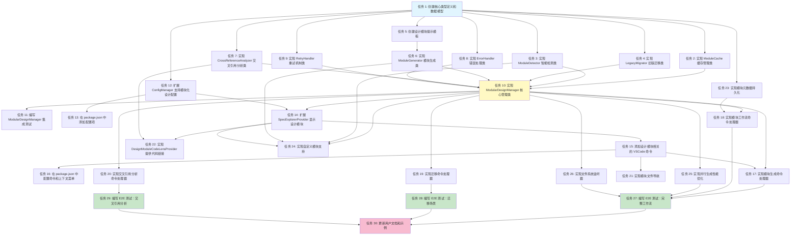

# 实施计划：模块化设计结构

## 概述

本实施计划将模块化设计结构功能的开发分解为一系列可执行的编码任务。每个任务都遵循增量开发原则，确保每一步都能构建在前面的基础上，并通过测试验证功能正确性。

---

## 任务列表

- [x] 1. 创建核心类型定义和数据模型
  - 在 `src/types/` 目录下创建 `modularDesign.ts` 文件
  - 定义 `ModuleType` 枚举（frontend, mobile, server-api, server-logic, server-database, testing）
  - 定义 `WorkflowState` 枚举（not-generated, pending-review, approved, rejected）
  - 定义核心接口：`ModuleInfo`, `CachedModuleInfo`, `GenerationContext`, `GenerationResult`, `ModularDesignConfig`
  - 为每个接口添加 JSDoc 注释说明用途
  - _需求：需求1（模块结构定义），需求3（模块生成），需求7（配置）_

- [x] 2. 实现 ModuleCache 缓存管理类
  - 在 `src/features/spec/` 目录下创建 `moduleCache.ts` 文件
  - 实现 `ModuleCache` 类，包含 `get()`, `set()`, `refresh()`, `clear()`, `invalidate()` 方法
  - 实现缓存过期机制（默认 5 分钟 TTL）
  - 实现 `scanModulesFromFileSystem()` 方法扫描模块文件
  - 实现 `checkLegacyDesign()` 方法检测旧版 design.md 文件
  - 编写单元测试验证缓存的存储、读取和过期逻辑
  - _需求：需求10（性能和错误处理），NFR-3（性能）_

- [x] 3. 实现 ModuleDetector 智能检测类
  - 在 `src/features/spec/` 目录下创建 `moduleDetector.ts` 文件
  - 实现 `ModuleDetector` 类，包含 `detectApplicableModules()` 和 `isModuleApplicable()` 方法
  - 初始化检测规则 `initializeDetectionRules()`，为每个模块类型定义关键词和正则模式
  - 实现关键词匹配逻辑（支持中英文关键词）
  - 实现正则模式匹配逻辑
  - 编写单元测试验证不同需求场景下的模块检测结果
  - _需求：需求6（模块适用性和智能检测）_

- [x] 4. 实现 LegacyMigrator 旧版迁移类
  - 在 `src/features/spec/` 目录下创建 `legacyMigrator.ts` 文件
  - 实现 `detectLegacyDesign()` 方法检测 design.md 文件
  - 实现 `analyzeLegacyContent()` 方法分析旧设计文档内容
  - 实现 `extractSections()` 方法提取章节（基于 Markdown 标题）
  - 实现 `guessModuleFromTitle()` 方法根据章节标题推断模块类型
  - 实现 `mapSectionsToModules()` 方法建立章节到模块的映射
  - 实现 `showMigrationWizard()` 方法显示迁移向导 UI
  - 实现 `createNoMigrateMarker()` 方法创建 `.no-migrate` 标记文件
  - 编写单元测试验证章节提取和映射逻辑
  - _需求：需求2（向后兼容）_

- [x] 5. 创建设计模块提示模板
  - 在 `src/prompts/` 目录下创建 `designModulePrompts.ts` 文件
  - 为每个模块类型创建专用的提示模板函数
  - 实现 `getFrontendDesignPrompt()` - 前端设计提示（组件架构、状态管理、路由、UI/UX）
  - 实现 `getMobileDesignPrompt()` - 移动端设计提示（平台特定、原生vs混合、离线能力）
  - 实现 `getServerApiDesignPrompt()` - 服务端 API 提示（端点定义、认证、请求/响应模式）
  - 实现 `getServerLogicDesignPrompt()` - 服务端逻辑提示（业务规则、服务层架构）
  - 实现 `getServerDatabaseDesignPrompt()` - 数据库设计提示（实体模型、关系、索引、迁移）
  - 实现 `getTestingDesignPrompt()` - 测试设计提示（单元测试、集成测试、E2E 测试）
  - 每个提示模板支持变量替换（specName, requirements, relatedModules）
  - _需求：需求3（模块生成和 AI 集成），需求9（文档和模块模板）_

- [x] 6. 实现 ModuleGenerator 模块生成类
  - 在 `src/features/spec/` 目录下创建 `moduleGenerator.ts` 文件
  - 实现 `ModuleGenerator` 类，包含 `generateModule()` 方法
  - 实现 `getModulePrompt()` 方法获取模块特定的提示
  - 集成 `ClaudeCodeProvider` 调用 Claude CLI 生成内容
  - 实现文件写入逻辑，将生成的内容保存到 `design-{moduleType}.md`
  - 实现错误处理和重试逻辑
  - 编写单元测试（使用 mock Claude provider）验证生成流程
  - _需求：需求3（模块生成和 AI 集成）_

- [x] 7. 实现 CrossReferenceAnalyzer 交叉引用分析类
  - 在 `src/features/spec/` 目录下创建 `crossReferenceAnalyzer.ts` 文件
  - 实现 `CrossReferenceAnalyzer` 类，包含 `analyzeReferences()` 方法
  - 实现引用提取逻辑（API 调用、数据模型、组件、服务引用）
  - 实现 `detectInconsistencies()` 方法检测模块间不一致性
  - 实现 `generateCrossLinks()` 方法生成模块间的交叉链接
  - 定义不一致性类型和严重级别（error, warning）
  - 编写单元测试验证引用分析和不一致性检测
  - _需求：需求8（跨模块引用和一致性）_

- [x] 8. 实现 ErrorHandler 错误处理类
  - 在 `src/utils/` 目录下创建 `errorHandler.ts` 文件
  - 实现 `ErrorHandler` 类，包含 `handleError()` 方法
  - 定义 `ErrorCategory` 枚举（filesystem, generation, validation, network, configuration）
  - 实现 `detectErrorCategory()` 方法自动检测错误类型
  - 实现 `isRetryable()` 方法判断错误是否可重试
  - 实现 `getUserMessage()` 方法生成用户友好的错误消息
  - 实现 `logError()` 方法记录详细的技术错误信息
  - 实现 `showUserMessage()` 方法显示错误提示对话框
  - 实现特定错误类型的处理方法（文件系统错误、配置错误等）
  - 编写单元测试验证不同错误场景的处理
  - _需求：需求10（性能和错误处理）_

- [x] 9. 实现 RetryHandler 重试机制类
  - 在 `src/utils/` 目录下创建 `retryHandler.ts` 文件
  - 实现 `RetryHandler` 类，包含 `withRetry()` 方法
  - 实现指数退避重试策略（1秒、2秒、4秒）
  - 设置最大重试次数为 3 次
  - 实现 `sleep()` 辅助方法
  - 编写单元测试验证重试逻辑和退避策略
  - _需求：需求10（性能和错误处理）_

- [x] 10. 实现 ModularDesignManager 核心管理类
  - 在 `src/features/spec/` 目录下创建 `modularDesignManager.ts` 文件
  - 实现 `ModularDesignManager` 类作为模块化设计的主入口
  - 实现 `generateDesignModules()` 方法生成所有或指定的设计模块
  - 支持串行和并行生成模式（通过 `options.parallel` 控制）
  - 实现 `generateSpecificModule()` 方法生成单个模块
  - 实现 `getModuleList()` 方法获取模块列表
  - 实现 `getModuleContent()`, `updateModule()`, `deleteModule()` 方法进行模块 CRUD 操作
  - 实现 `isLegacyDesign()` 和 `migrateLegacyDesign()` 方法处理向后兼容
  - 实现 `getModuleWorkflowState()` 和 `updateModuleWorkflowState()` 方法管理工作流状态
  - 实现 `canProgressToTasks()` 方法检查是否所有必需模块已批准
  - 集成 `ModuleDetector`, `ModuleGenerator`, `ModuleCache`, `LegacyMigrator`, `ErrorHandler`
  - 实现元数据文件 `.module-metadata.json` 的读写
  - 编写单元测试验证核心管理逻辑
  - _需求：需求1（模块结构），需求3（模块生成），需求5（模块工作流），需求10（错误处理）_

- [x] 11. 编写 ModularDesignManager 集成测试
  - 创建测试文件 `src/features/spec/__tests__/modularDesignManager.integration.test.ts`
  - 实现测试工作区创建和清理辅助函数
  - 测试完整生成流程：创建 spec → 生成所有模块 → 验证文件存在
  - 测试并行生成：验证多个模块同时生成
  - 测试部分失败场景：模拟某个模块生成失败，验证其他模块继续生成
  - 测试缓存机制：验证缓存的创建、读取和刷新
  - 测试工作流状态转换：pending-review → approved → can progress to tasks
  - _需求：需求5（模块工作流），需求10（性能和错误处理），NFR-3（性能）_

- [x] 12. 扩展 ConfigManager 支持模块化设计配置
  - 修改 `src/utils/configManager.ts` 文件
  - 在 `KfcSettings` 接口中添加 `features.modularDesign` 配置
  - 定义 `ModularDesignConfig` 接口（enabled, defaultModules, fileNamingPattern, autoDetectModules, parallelGeneration, cacheEnabled, cacheTTL, customModules, autoMigrateLegacy, showMigrationPrompt, validateCrossReferences, warnOnInconsistencies）
  - 实现默认配置 `DEFAULT_MODULAR_DESIGN_CONFIG`
  - 添加 `getModularDesignConfig()` 方法获取模块化设计配置
  - 编写单元测试验证配置加载和默认值
  - _需求：需求7（配置和自定义）_

- [x] 13. 在 package.json 中添加配置项
  - 修改 `package.json` 的 `contributes.configuration` 部分
  - 添加 `kfc.features.modularDesign.enabled` 配置（boolean, 默认 false）
  - 添加 `kfc.features.modularDesign.defaultModules` 配置（array）
  - 添加 `kfc.features.modularDesign.autoDetectModules` 配置（boolean, 默认 true）
  - 添加 `kfc.features.modularDesign.parallelGeneration` 配置（boolean, 默认 true）
  - 添加 `kfc.features.modularDesign.cacheEnabled` 配置（boolean, 默认 true）
  - 添加 `kfc.features.modularDesign.showMigrationPrompt` 配置（boolean, 默认 true）
  - 为每个配置项添加描述文本（中文）
  - _需求：需求7（配置和自定义）_

- [x] 14. 扩展 SpecExplorerProvider 显示设计模块
  - 修改 `src/providers/specExplorerProvider.ts` 文件
  - 在 `getChildren()` 方法中添加模块化设计检测逻辑
  - 实现 `getModularDesignChildren()` 方法返回模块化结构（requirements, Design Modules 节点, tasks）
  - 实现 `getDesignModuleChildren()` 方法展开 Design Modules 节点，显示所有模块
  - 实现 `getModuleLabel()` 方法返回模块的中文显示名称
  - 实现 `getModuleIcon()` 方法根据模块状态返回不同图标
  - 实现 `getModuleTooltip()` 方法显示模块状态和最后修改时间
  - 实现 `getLegacyDesignChildren()` 方法保持向后兼容，显示单一 design.md
  - 集成 `ModularDesignManager` 获取模块列表
  - _需求：需求4（用户界面和导航），需求2（向后兼容）_

- [x] 15. 添加设计模块相关的 VSCode 命令
  - 修改 `src/extension.ts` 文件
  - 注册命令 `kfc.spec.designModule.generateAll` - 生成所有设计模块
  - 注册命令 `kfc.spec.designModule.generateSpecific` - 生成特定模块
  - 注册命令 `kfc.spec.designModule.approve` - 批准模块
  - 注册命令 `kfc.spec.designModule.reject` - 拒绝模块
  - 注册命令 `kfc.spec.designModule.regenerate` - 重新生成模块
  - 注册命令 `kfc.spec.designModule.delete` - 删除模块
  - 注册命令 `kfc.spec.designModule.migrate` - 迁移旧版设计
  - 注册命令 `kfc.spec.navigate.designModule` - 打开模块文件
  - 注册命令 `kfc.spec.designModule.analyzeReferences` - 分析交叉引用
  - 每个命令实现对应的处理逻辑，调用 `ModularDesignManager` 的方法
  - _需求：需求4（用户界面和导航），需求5（模块工作流）_

- [x] 16. 在 package.json 中配置命令和上下文菜单
  - 修改 `package.json` 的 `contributes.commands` 部分
  - 添加所有新命令的声明（title, category, icon）
  - 修改 `contributes.menus` 部分
  - 在 `view/item/context` 菜单中为设计模块节点添加上下文菜单项
  - 配置菜单项的显示条件（when 表达式），例如 `viewItem == 'spec-design-module-frontend'`
  - 添加右键菜单：批准、拒绝、重新生成、删除、分析引用
  - 在 `view/title` 菜单中添加"生成所有设计模块"按钮
  - _需求：需求4（用户界面和导航），需求5（模块工作流）_

- [x] 17. 实现模块生成命令处理器
  - 在 `src/features/spec/` 目录下创建 `designModuleCommands.ts` 文件
  - 实现 `handleGenerateAllModules()` 命令处理函数
  - 显示进度提示（使用 `vscode.window.withProgress`）
  - 调用 `ModularDesignManager.generateDesignModules()`
  - 处理生成结果，显示成功或失败消息
  - 刷新 TreeView
  - 实现 `handleGenerateSpecificModule()` 命令处理函数
  - 显示快速选择框让用户选择模块类型
  - 生成选中的模块
  - 编写单元测试（使用 mock）验证命令处理逻辑
  - _需求：需求5（模块工作流），需求3（模块生成）_

- [x] 18. 实现模块工作流命令处理器
  - 在 `src/features/spec/designModuleCommands.ts` 中添加工作流处理函数
  - 实现 `handleApproveModule()` 命令处理函数
  - 更新模块状态为 'approved'
  - 检查是否所有必需模块已批准
  - 如果可以进入任务阶段，显示提示消息
  - 实现 `handleRejectModule()` 命令处理函数
  - 更新模块状态为 'rejected'
  - 提示用户可以重新生成
  - 实现 `handleRegenerateModule()` 命令处理函数
  - 确认是否覆盖现有内容
  - 调用 `generateSpecificModule()` 重新生成
  - 实现 `handleDeleteModule()` 命令处理函数
  - 显示确认对话框
  - 删除模块文件和元数据
  - 编写单元测试验证工作流状态转换
  - _需求：需求5（模块工作流）_

- [x] 19. 实现迁移命令处理器
  - 在 `src/features/spec/designModuleCommands.ts` 中添加迁移处理函数
  - 实现 `handleMigrateLegacyDesign()` 命令处理函数
  - 检测是否存在旧版 design.md 文件
  - 调用 `LegacyMigrator.showMigrationWizard()` 显示向导
  - 如果用户确认，调用 `analyzeLegacyContent()` 分析内容
  - 显示映射预览对话框，让用户确认章节到模块的映射
  - 执行迁移：为每个模块创建文件，复制对应章节内容
  - 重命名旧文件为 `design.md.backup`
  - 创建 `.module-metadata.json` 文件
  - 显示成功通知并刷新 TreeView
  - 编写集成测试验证完整迁移流程
  - _需求：需求2（向后兼容）_

- [x] 20. 实现交叉引用分析命令处理器
  - 在 `src/features/spec/designModuleCommands.ts` 中添加分析处理函数
  - 实现 `handleAnalyzeReferences()` 命令处理函数
  - 读取所有已生成的设计模块
  - 调用 `CrossReferenceAnalyzer.analyzeReferences()` 分析引用
  - 调用 `detectInconsistencies()` 检测不一致性
  - 生成诊断信息（`vscode.Diagnostic`）并显示在问题面板
  - 实现快速修复建议（`vscode.CodeAction`）
  - 为每个不一致性提供导航到源位置的功能
  - 编写单元测试验证引用分析和诊断生成
  - _需求：需求8（跨模块引用和一致性）_

- [x] 21. 实现模块文件导航
  - 修改 `src/providers/specExplorerProvider.ts` 文件
  - 为每个设计模块 TreeItem 添加 `command` 属性
  - 实现 `handleNavigateToDesignModule()` 命令处理函数
  - 构建模块文件路径 `{specBasePath}/{specName}/design-{moduleType}.md`
  - 使用 `vscode.window.showTextDocument()` 打开文件
  - 如果文件不存在，提示是否生成该模块
  - 编写单元测试验证导航逻辑
  - _需求：需求4（用户界面和导航）_

- [x] 22. 实现 DesignModuleCodeLensProvider 提供代码链接
  - 在 `src/providers/` 目录下创建 `designModuleCodeLensProvider.ts` 文件
  - 实现 `DesignModuleCodeLensProvider` 类，继承 `vscode.CodeLensProvider`
  - 实现 `provideCodeLenses()` 方法
  - 检测文件是否为设计模块文件（匹配 `design-*.md` 模式）
  - 在文件顶部添加 CodeLens 链接到相关模块
  - 在文件顶部添加 CodeLens 链接到 requirements.md
  - 实现 `resolveCodeLens()` 方法
  - 在 `extension.ts` 中注册 CodeLensProvider
  - 编写单元测试验证 CodeLens 生成
  - _需求：需求4（用户界面和导航），需求8（跨模块引用）_

- [x] 23. 实现模块元数据持久化
  - 在 `src/features/spec/` 目录下创建 `moduleMetadata.ts` 文件
  - 实现 `ModuleMetadata` 类管理 `.module-metadata.json` 文件
  - 实现 `load()` 方法读取元数据文件
  - 实现 `save()` 方法保存元数据文件
  - 实现 `updateModuleState()` 方法更新单个模块的状态
  - 实现 `getModuleState()` 方法获取模块状态
  - 实现 `canProgressToTasks()` 方法检查是否可以进入任务阶段
  - 定义元数据文件结构（version, modules, canProgressToTasks）
  - 实现元数据文件的版本控制和迁移
  - 编写单元测试验证元数据的读写和状态管理
  - _需求：需求5（模块工作流）_

- [x] 24. 实现自定义模块支持
  - 修改 `src/types/modularDesign.ts` 文件
  - 定义 `CustomModuleDefinition` 接口（type, name, fileName, promptTemplate, detectionRules, icon）
  - 修改 `ModuleDetector` 支持自定义模块的检测规则
  - 修改 `ModuleGenerator` 支持自定义提示模板
  - 修改 `SpecExplorerProvider` 支持显示自定义模块
  - 实现自定义模块配置的验证逻辑
  - 编写单元测试验证自定义模块的加载和使用
  - _需求：需求7（配置和自定义），NFR-5（可扩展性）_

- [x] 25. 实现并行生成性能优化
  - 在 `src/utils/` 目录下创建 `parallelExecutor.ts` 文件
  - 实现 `ParallelExecutor` 类
  - 实现 `executeBatch()` 方法以批次执行任务
  - 设置最大并发数（默认 4）
  - 实现任务队列管理
  - 实现进度报告机制
  - 修改 `ModularDesignManager.generateDesignModules()` 使用 ParallelExecutor
  - 编写性能测试验证并行生成比串行生成快
  - _需求：需求10（性能和错误处理），NFR-3（性能）_

- [x] 26. 实现文件系统监听器
  - 在 `src/features/spec/` 目录下创建 `moduleFileWatcher.ts` 文件
  - 实现 `ModuleFileWatcher` 类
  - 使用 `vscode.workspace.createFileSystemWatcher()` 监听设计模块文件变化
  - 监听文件创建、修改、删除事件
  - 当文件变化时，自动刷新缓存和 TreeView
  - 实现防抖机制避免频繁刷新
  - 在 `extension.ts` 中启动文件监听器
  - 编写集成测试验证文件变化检测
  - _需求：需求10（性能和错误处理）_

- [x] 27. 编写 E2E 测试：完整工作流
  - 创建测试文件 `src/__tests__/e2e/modularDesign.e2e.test.ts`
  - 测试完整工作流：
    1. 创建新 spec
    2. 生成 requirements.md
    3. 生成所有设计模块
    4. 验证所有模块文件已创建
    5. 模拟审核：批准所有模块
    6. 验证 canProgressToTasks 为 true
    7. 生成 tasks.md
  - 测试拒绝和重新生成流程
  - 测试删除模块流程
  - 验证 TreeView 正确显示所有状态
  - _需求：需求1-6（所有功能需求）_

- [x] 28. 编写 E2E 测试：迁移场景
  - 创建测试文件 `src/__tests__/e2e/legacyMigration.e2e.test.ts`
  - 创建带有旧 design.md 的测试 spec
  - 模拟用户触发迁移
  - 验证章节正确提取和映射
  - 验证模块文件正确创建
  - 验证旧文件重命名为 .backup
  - 验证 TreeView 更新为模块化结构
  - 测试"不再提示"选项，验证 .no-migrate 标记创建
  - _需求：需求2（向后兼容）_

- [x] 29. 编写 E2E 测试：交叉引用分析
  - 创建测试文件 `tests/e2e/crossReference.e2e.test.ts`
  - 创建包含模块间引用的测试设计文件
  - 前端模块引用 API 端点
  - API 模块定义端点
  - 数据库模块定义模型
  - 触发交叉引用分析
  - 验证引用正确识别
  - 模拟不一致性场景（API 未定义但前端引用）
  - 验证诊断信息正确生成
  - _需求：需求8（跨模块引用和一致性）_

- [x] 30. 更新用户文档和示例
  - 创建 `docs/modular-design.md` 文档
  - 说明模块化设计功能的概念和优势
  - 提供使用指南：如何启用功能、生成模块、审核工作流
  - 提供配置说明：所有配置项的详细解释
  - 提供迁移指南：如何从旧版设计迁移到模块化结构
  - 提供自定义模块示例
  - 创建示例 spec 展示完整的模块化设计结构
  - 更新 README.md 添加新功能介绍
  - 创建 CHANGELOG.md 条目记录新功能
  - _需求：需求9（文档和模块模板）_

---

## 任务依赖关系图

---

## 实施说明

### 开发顺序

任务按照编号顺序执行，确保每个任务的依赖项已完成：

1. **第一阶段（任务 1-9）**：基础设施层
   - 建立核心数据模型和类型
   - 实现各个独立的功能类
   - 每个类都有明确的职责和接口

2. **第二阶段（任务 10-13）**：核心业务逻辑层
   - 实现 ModularDesignManager 整合所有功能
   - 配置系统集成
   - 集成测试验证核心功能

3. **第三阶段（任务 14-22）**：用户界面层
   - UI 组件和 TreeView 扩展
   - 命令注册和处理
   - CodeLens 和导航功能

4. **第四阶段（任务 23-26）**：高级功能层
   - 元数据持久化
   - 自定义模块支持
   - 性能优化
   - 文件监听

5. **第五阶段（任务 27-30）**：测试和文档层
   - E2E 测试覆盖主要场景
   - 用户文档和示例

### 测试策略

- **单元测试**：每个类和函数都应有对应的单元测试
- **集成测试**：验证多个组件协同工作
- **E2E 测试**：验证完整的用户工作流
- **性能测试**：确保并行生成和缓存机制有效

### 增量发布策略

按照设计文档中的功能开关策略：

- **v0.3.0**：功能默认禁用，内部测试
- **v0.4.0**：功能默认禁用，公开测试
- **v0.5.0**：功能默认启用，正式发布

### 注意事项

1. **向后兼容性**：所有任务都必须保持对现有 spec 的向后兼容
2. **错误处理**：每个任务都应实现适当的错误处理和用户提示
3. **性能考量**：注意并行生成和缓存机制的实现
4. **用户体验**：UI 操作应提供即时反馈和进度指示
5. **代码质量**：遵循项目的代码规范，保持代码可读性和可维护性

---

**文档版本**: v2
**创建日期**: 2025-10-14
**语言**: 中文
