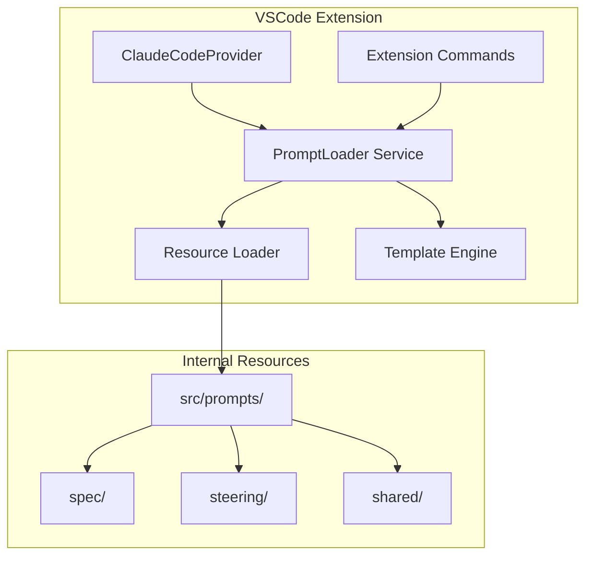

# Design Document

## Overview

本设计方案旨在将 Kiro for CC 扩展中硬编码的 prompt 模板分离到独立的 Markdown 文件中，作为内部资源进行管理。通过建立标准化的 prompt 文件结构和加载机制，提高代码的可维护性和开发效率。

## Architecture

### 系统架构图



### 核心设计原则

1. **一步到位**：直接替换所有硬编码 prompt，不保留降级逻辑
2. **简单直接**：减少中间层，降低复杂度
3. **开发友好**：提供便捷的开发工具和调试功能
4. **性能优先**：使用缓存机制，避免频繁的文件 I/O

## Components and Interfaces

### 1. Prompt 文件格式

采用 Markdown + Frontmatter 格式，实现配置与内容的优雅分离：

```markdown
<!-- src/prompts/spec/agent-system.md -->
---
id: spec-agent-system
name: Spec Agent System Prompt
version: 1.0.0
description: System prompt for spec agent workflow
variables:
  specsPath:
    type: string
    required: true
    description: Base path for specs
---

# System Prompt - Spec Agent

## Goal

You are an agent that specializes in working with Specs in Claude Code.
Specs base path: {{specsPath}}

## Workflow to execute

...
```

**优势**：

- Prompt 内容使用自然的 Markdown 格式，无需转义
- Frontmatter 存储元数据，结构清晰
- VSCode 原生支持语法高亮和预览
- Git 版本控制友好

### 2. PromptLoader Service

核心服务，负责加载、解析和渲染 prompt：

**实现要点**：

- 使用 Webpack 的 `raw-loader` 将 .md 文件作为字符串导入
- 使用 `gray-matter` 库解析 Markdown frontmatter
- 使用 Handlebars 模板引擎处理变量替换
- 启动时预编译所有模板，存储在内存中

```typescript
interface PromptLoader {
  // 加载内部 prompt 资源
  loadPrompt(promptId: string): PromptTemplate;
  
  // 渲染 prompt，替换变量
  renderPrompt(promptId: string, variables: Record<string, any>): string;
  
  // 获取所有可用的 prompt
  listPrompts(): PromptMetadata[];
  
  // 预加载所有 prompt（初始化时调用）
  initialize(): void;
}

interface PromptTemplate {
  id: string;
  name: string;
  version: string;
  description?: string;
  variables?: VariableDefinition[];
  template: string;
}
```

### 3. Prompt 导出接口

直接替换现有的硬编码实现：

```typescript
// 修改现有的 prompts 文件
export function getSpecAgentSystemPrompt(specsPath: string): string {
  const loader = PromptLoader.getInstance();
  return loader.renderPrompt('spec-agent-system', { specsPath });
}

// 保持接口兼容，仅改变内部实现
export const SPEC_REFINE_PROMPTS = {
  requirements: (content: string) => 
    loader.renderPrompt('spec-requirements-refine', { content }),
  design: (content: string) => 
    loader.renderPrompt('spec-design-refine', { content }),
  tasks: (content: string) => 
    loader.renderPrompt('spec-tasks-refine', { content })
};
```

## Data Models

### 目录结构

```plain
src/
├── prompts/           # Prompt 资源文件
│   ├── spec/
│   │   ├── agent-system.md
│   │   ├── requirements-refine.md
│   │   ├── design-refine.md
│   │   └── tasks-refine.md
│   ├── steering/
│   │   ├── system.md
│   │   ├── initial-product.md
│   │   ├── initial-structure.md
│   │   └── refine.md
│   └── shared/
│       └── common-templates.md
├── services/          # 服务层
│   └── promptLoader.ts
└── types/
    └── prompt.types.ts
```

### Prompt Frontmatter Schema

```typescript
interface PromptFrontmatter {
  // 必填字段
  id: string;              // 唯一标识符，使用 kebab-case
  name: string;            // 显示名称
  version: string;         // 语义化版本号 (x.y.z)
  
  // 可选字段
  description?: string;    // 描述
  author?: string;         // 作者
  tags?: string[];         // 标签，用于分类和搜索
  extends?: string;        // 继承另一个 prompt 的 ID
  
  // 变量定义
  variables?: {
    [key: string]: {
      type: 'string' | 'number' | 'boolean' | 'array' | 'object';
      required?: boolean;
      default?: any;
      description?: string;
    }
  };
}
```

**示例文件**：

```markdown
---
id: spec-requirements-refine
name: Requirements Refinement Prompt
version: 1.0.0
description: Refines requirements document based on user feedback
tags: [spec, requirements, refinement]
variables:
  requirements:
    type: string
    required: true
    description: Current requirements document content
  feedback:
    type: string
    required: true
    description: User feedback to incorporate
---

# Requirements Refinement

Based on the following requirements document:

{{requirements}}

User feedback:
{{feedback}}

Please refine the requirements document...
```

## Error Handling

### 错误类型和处理策略

1. **资源不存在**
   - 开发时构建失败，提示缺失的文件
   - 运行时抛出明确的错误信息
   - 列出所有可用的 prompt ID

2. **语法错误**
   - 编辑时实时提示
   - 保存时阻止并显示错误
   - 提供修复建议

3. **变量缺失**
   - 使用默认值（如果定义）
   - 抛出明确的错误信息
   - 列出所有必需的变量

4. **版本不兼容**
   - 检查 schema 版本
   - 提供迁移指导
   - 保持向后兼容

## Testing Strategy

### 单元测试

1. **PromptLoader 测试**
   - 加载有效/无效文件
   - 变量替换逻辑
   - 缓存机制
   - 错误处理

2. **模板引擎测试**
   - 变量替换
   - 条件逻辑
   - 循环结构
   - 转义处理

### 集成测试

1. **端到端工作流**
   - 创建新 prompt
   - 编辑并保存
   - 在 Claude Code 中使用
   - 验证输出正确

2. **迁移验证**
   - 确保所有 prompt 都已转换为文件
   - 验证功能一致性
   - 性能对比测试

### 手动测试

1. **开发体验**
   - 编辑器功能
   - 错误提示
   - 自动完成
   - 快速操作

2. **用户场景**
   - Spec 创建流程
   - Steering 文档生成
   - Prompt 调试

## 实现细节

### 技术选型

1. **Frontmatter 解析**：使用 `gray-matter` 库
2. **模板引擎**：使用 `handlebars` 处理变量替换
3. **资源加载**：使用 Webpack 的 `raw-loader` 导入 .md 文件
4. **缓存策略**：启动时预加载所有模板到内存
5. **Markdown 处理**：直接使用原始内容，不需要额外解析

### 性能优化

1. **预加载**：扩展激活时加载所有 prompt
2. **预编译**：Handlebars 模板在初始化时编译
3. **内存缓存**：所有模板常驻内存
4. **同步访问**：无需异步 I/O，提高响应速度

### 安全考虑

1. **内部资源**：prompt 文件打包在扩展内，用户无法修改
2. **模板注入**：转义用户输入的变量
3. **类型安全**：TypeScript 类型定义确保参数正确
4. **构建时验证**：打包时验证所有 prompt 文件的格式

## Task Implementation Context Design

> **注意**：本章节作为设计补充备忘，记录未来的实现思路，不在本期 prompt-separation 功能中实现。

### 概述

当执行 spec 中的具体任务时，需要为 Claude Code 提供充分的上下文信息。这包括：

1. **Steering 文档**：项目级别的指导原则和约定
2. **Spec 文档**：特定功能的需求、设计和任务列表

### 上下文加载策略

```typescript
interface TaskContext {
  // Steering 文档内容
  steeringDocuments: SteeringDocument[];
  
  // 当前 spec 的所有文档
  spec: {
    requirements: string;
    design: string;
    tasks: string;
    currentTask: TaskInfo;
  };
}

interface SteeringDocument {
  name: string;
  content: string;
  // 可以扩展包含优先级、适用范围等元数据
}
```

### 实现方案

1. **上下文收集器**
   - 在执行任务前，自动收集所有相关的 steering 文档
   - 加载当前 spec 的完整文档（requirements, design, tasks）
   - 识别当前要执行的具体任务

2. **Prompt 构建**
   - 将收集的上下文按优先级组织
   - Steering 文档作为全局指导
   - Spec 文档作为具体功能上下文
   - 当前任务作为执行焦点

3. **示例 Prompt 结构**

   ```markdown
   <system>
   # Project Steering Context
   
   {{#each steeringDocuments}}
   ## {{name}}
   {{content}}
   {{/each}}
   </system>
   
   # Feature Specification
   
   ## Requirements
   {{spec.requirements}}
   
   ## Design
   {{spec.design}}
   
   ## Current Task
   From the task list, implement the following:
   {{spec.currentTask.description}}
   
   Task details:
   {{spec.currentTask.details}}
   ```

### 集成点

1. **任务执行命令**
   - 修改 `kfc.task.implement` 命令
   - 在调用 Claude Code 前自动加载上下文

2. **ClaudeCodeProvider**
   - 新增 `executeTaskWithContext` 方法
   - 负责收集和组织上下文

3. **SpecManager**
   - 提供获取完整 spec 文档的方法
   - 支持任务定位和提取

### 优势

1. **完整上下文**：Claude Code 能够理解项目约定和具体需求
2. **一致性**：确保实现符合项目标准和设计方案
3. **自动化**：无需手动复制粘贴文档内容
4. **可扩展**：未来可以添加更多上下文源（如相关代码、测试等）
