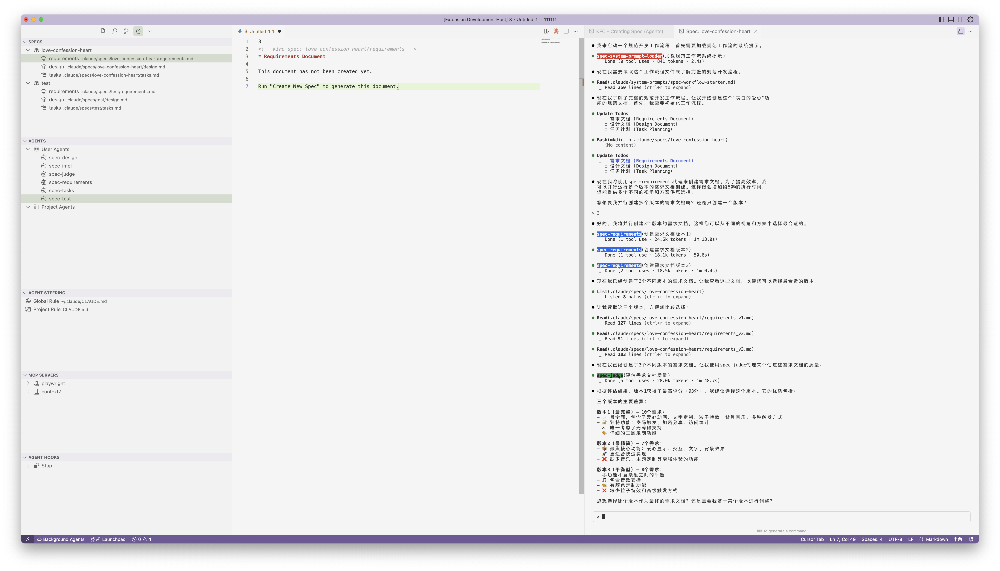

# Kiro for Claude Code

[](https://marketplace.visualstudio.com/items?itemName=heisebaiyun.kiro-for-cc)
[](https://marketplace.visualstudio.com/items?itemName=heisebaiyun.kiro-for-cc)

> [!IMPORTANT]
> **🎉 重要更新：Sub Agent 版本已上线！**  
> 现在支持通过 Sub Agent 功能增强 Claude Code 的工作流程能力。使用专门的 agent 进行需求、设计和任务的并行处理来创建规范。

为 Claude Code 带来规范驱动开发的 VSCode 扩展。在充分利用 Claude Code 强大 AI 能力的同时，可视化管理你的规范文档和指导文档。

**新功能：使用 Sub Agent 创建 SPEC ：**

1. 点击活动栏中的 Kiro for CC 图标
2. 在 SPEC 视图右上角，点击 "New Spec with Agents" 按钮（带闪光图标 ✨）
3. 输入功能描述
4. Claude 将自动：
   - 加载规范工作流系统提示
   - 将工作委派给专门的 agent（需求、设计、任务）
   - 使用独立的上下文窗口并行处理每个阶段
5. 随着 agent 完成工作，审查输出结果

<p align="center">
  
</p>

> **注意**：Sub Agent 目前会出现执行时间偶尔很长的 bug。为了兼容原有功能，保留了两种方式：点击原有的 `+` 按钮仍使用旧版方式，新的 Sub Agent 按钮使用新方式。目前测试下来两者不会冲突，但可能会遇到问题。
>
## 功能特性

### 📝 SPEC 管理

- **创建规范**：在 Claude 的帮助下生成需求、设计和任务文档
- **可视化浏览器**：在侧边栏中浏览和管理规范
- **规范工作流**：需求 → 设计 → 任务，每步都需审查确认
- **新功能：Sub Agent 支持**：使用专门的 agent 进行并行处理来创建规范

### 🤖 AGENT 管理

- **用户和项目 Agent**：查看和管理用户级和项目级的 Claude Code agent
- **内置 Agent**：预配置的规范工作流 agent（需求、设计、任务、评审等）
- **Agent 浏览器**：使用语法高亮浏览和编辑 agent 配置

### 🎯 STEERING 管理

- **CLAUDE.md**：浏览以及编辑 全局/项目特定的指导原则
- **生成文档**：产品、技术和结构指导文档

### 🔌 MCP 管理

- **MCP 服务器**：查看已配置的全局以及工作区 MCP 服务器

### 🪝 HOOKS 管理

- **代理钩子**：查看 Claude Code 钩子

### ⚙️ 其他

- **设置管理**：集中化配置管理

## 界面截图



*该扩展提供了一个综合性的侧边栏界面，包含规范、引导文档、MCP 服务器和钩子管理等有序组织的视图。所有 Claude Code 增强工具都集中在一个地方。*

## 安装

### 前置条件

1. **Claude Code 安装**：确保 Claude Code 已安装并配置

2. **兼容性**：

| 平台                      | 支持情况 | 说明               | 状态     |
| ------------------------- | -------- | ------------------ | -------- |
| macOS                     | ✅        | 完全支持           | released |
| Linux                     | ✅        | 完全支持           | released |
| Windows (WSL)             | ✅        | 支持，自动路径转换 | released |
| Windows (CMD)             | ❌        | 不支持             | TBD      |
| Windows (PowerShell)      | ❌        | 不支持             | TBD      |
| Windows (MinTTY Git Bash) | ❌        | 不支持             | TBD      |

### 从扩展商店安装

**VSCode 用户：**

1. 打开 VSCode
2. 进入扩展页面 (Cmd+Shift+X)
3. 搜索 "Kiro for Claude Code"
4. 点击安装

或使用命令行：

```bash
code --install-extension heisebaiyun.kiro-for-cc
```

**Cursor 用户：**
该扩展已发布到 OpenVSX Registry。在 Cursor 中：

1. 进入扩展页面
2. 搜索 "Kiro for Claude Code"
3. 点击安装

或使用命令行：

```bash
cursor --install-extension heisebaiyun.kiro-for-cc
```

### 从 VSIX 文件安装

从 [GitHub Releases](https://github.com/notdp/kiro-for-cc/releases/latest) 下载最新的 `.vsix` 文件，然后：

```bash
# VSCode
code --install-extension kiro-for-cc-{latest-version}.vsix

# Cursor
cursor --install-extension kiro-for-cc-{latest-version}.vsix
```

将 `{latest-version}` 替换为实际版本号，例如 `0.2.2`。

## 使用方法

### 创建规范

**传统方法：**

1. 点击活动栏中的 Kiro for CC 图标
2. 在 SPEC 视图中，点击 `+` 按钮
3. 输入功能描述
4. Claude 将生成需求文档
5. 审查并批准后再继续设计
6. 设计完成后再生成任务

### 规范工作流

1. **需求**：定义你想要构建的内容
2. **设计**：在需求批准后创建技术设计
3. **任务**：在设计批准后生成实施任务
4. **实施**：逐个执行任务

### 指导文档

创建项目特定的指导：

- 点击 ✨ 图标创建自定义指导
- 生成初始文档（产品、技术、结构）
- 文档存储在 `.claude/steering/` 目录

## 配置

设置存储在 `.claude/settings/kfc-settings.json`：

```json
{
  "paths": {
    "specs": ".claude/specs",
    "steering": ".claude/steering",
    "settings": ".claude/settings"
  },
  "views": {
    "specs": {
      "visible": true
    },
    "steering": {
      "visible": true
    },
    "mcp": {
      "visible": true
    },
    "hooks": {
      "visible": true
    },
    "settings": {
      "visible": false
    }
  }
}
```

## 工作区结构

扩展会在你的工作区创建以下结构：

```plain
.claude/                      # 扩展数据目录
├── specs/                    # 功能规范
│   └── {规范名称}/
│       ├── requirements.md   # 构建什么
│       ├── design.md        # 如何构建
│       └── tasks.md         # 实施步骤
├── agents/                  # Claude Code agents
│   └── kfc/                 # 内置 agents（自动初始化）
│       ├── spec-requirements.md
│       ├── spec-design.md
│       ├── spec-tasks.md
│       ├── spec-judge.md
│       ├── spec-impl.md
│       ├── spec-test.md
│       └── spec-system-prompt-loader.md
├── steering/                # AI 指导文档
│   ├── product.md          # 产品规范
│   ├── tech.md            # 技术标准
│   └── structure.md       # 代码组织
├── settings/
│   └── kfc-settings.json  # 扩展设置
```

## 开发

### 环境要求

- Node.js 16+
- VSCode 1.84.0+
- TypeScript 5.3.0+

### 开发设置

```bash
# 克隆仓库
git clone https://github.com/notdp/kiro-for-cc.git
cd kiro-for-cc

# 安装依赖
npm install

# 编译 TypeScript
npm run compile

# 监视模式（文件变更自动编译）
npm run watch
```

### 运行扩展

1. 在 VSCode 中打开项目
2. 按 `F5` 启动扩展开发主机
3. 扩展将在新的 VSCode 窗口中可用

### 构建

```bash
# 构建 VSIX 包
npm run package

# 输出：kiro-for-cc-{latest-version}.vsix
```

### 项目代码结构

```plain
src/
├── extension.ts              # 扩展入口，命令注册
├── constants.ts              # 配置常量
├── features/                 # 业务逻辑
│   ├── spec/
│   │   └── specManager.ts    # 规范生命周期管理
│   ├── steering/
│   │   └── steeringManager.ts # 指导文档管理
│   └── agents/
│       └── agentManager.ts   # Agent 初始化和管理
├── providers/                # VSCode 树形视图提供者
│   ├── claudeCodeProvider.ts # Claude CLI 集成
│   ├── specExplorerProvider.ts
│   ├── steeringExplorerProvider.ts
│   ├── agentsExplorerProvider.ts    # 新增：Agent 浏览器
│   ├── hooksExplorerProvider.ts
│   ├── mcpExplorerProvider.ts
│   └── overviewProvider.ts
├── prompts/                  # AI 提示词模板
│   ├── specPrompts.ts        # 规范生成提示词
│   ├── steeringPrompts.ts    # 指导文档提示词
│   └── spec/
│       └── create-spec-with-agents.md # 新增：Sub agent 工作流
├── resources/                # 内置资源
│   ├── agents/              # 预配置的 agents
│   └── prompts/             # 系统提示词
└── utils/
    └── configManager.ts      # 配置管理
```

### 核心架构概念

- **管理器模式**：每个功能都有一个 Manager 类处理业务逻辑
- **提供者模式**：树形视图扩展 `vscode.TreeDataProvider`
- **命令模式**：所有命令遵循 `kfc.{feature}.{action}` 命名规范
- **配置管理**：通过 `ConfigManager` 集中管理，提供灵活性

## 许可证

MIT 许可证 - 详见 [LICENSE](./LICENSE)
