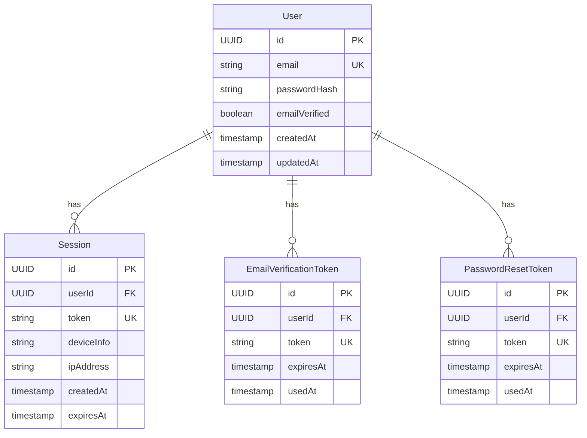

# 模块化设计结构示例

本文档展示一个使用模块化设计结构的完整 spec 示例。

## 示例项目: 用户认证系统

这是一个典型的全栈项目,包含前端、后端 API、数据库和测试设计。

### 项目结构

```
.claude/specs/user-authentication-system/
├── requirements.md              # 需求文档
├── design-frontend.md           # 前端设计模块
├── design-server-api.md         # 服务端 API 设计模块
├── design-server-logic.md       # 服务端逻辑设计模块
├── design-server-database.md    # 数据库设计模块
├── design-testing.md            # 测试设计模块
├── tasks.md                     # 任务文档
└── .module-metadata.json        # 模块元数据
```

## requirements.md

```markdown
# Requirements: User Authentication System

## Overview

构建一个安全的用户认证系统,支持用户注册、登录、密码重置和会话管理。系统需要提供 Web 界面和 REST API。

## Functional Requirements

### User Registration
- 用户可以通过邮箱和密码注册账户
- 系统验证邮箱格式和密码强度
- 注册成功后发送验证邮件
- 用户必须验证邮箱才能登录

### User Login
- 用户使用邮箱和密码登录
- 系统返回 JWT 令牌用于后续请求
- 支持"记住我"功能(延长会话时间)
- 限制连续失败登录次数,防止暴力破解

### Password Reset
- 用户可以通过邮箱请求密码重置
- 系统发送包含重置链接的邮件
- 重置链接有效期为 1 小时
- 用户设置新密码后,所有现有会话失效

### Session Management
- 用户可以查看当前活跃的会话
- 用户可以登出单个会话或所有会话
- 会话默认有效期为 7 天
- 系统自动清理过期会话

## Technical Stack

### Frontend
- React 18+ with TypeScript
- Redux Toolkit for state management
- React Router v6 for routing
- Axios for API calls
- Tailwind CSS for styling

### Backend
- Node.js 18+ with Express
- TypeScript
- JWT for authentication
- Bcrypt for password hashing
- Nodemailer for email sending

### Database
- PostgreSQL 14+
- Prisma ORM

### Testing
- Frontend: Jest + React Testing Library
- Backend: Jest + Supertest
- E2E: Playwright

## Non-Functional Requirements

### Security
- 密码使用 bcrypt 加密存储(成本因子 10)
- JWT 使用 RS256 算法签名
- 所有 API 端点使用 HTTPS
- 实施 CORS 策略
- 防止 SQL 注入和 XSS 攻击

### Performance
- API 响应时间 < 200ms (P95)
- 支持并发 1000 个用户
- 数据库查询优化,添加必要索引

### Usability
- 响应式设计,支持移动端和桌面端
- 表单验证提供实时反馈
- 错误消息清晰易懂

### Maintainability
- 代码覆盖率 > 80%
- 使用 ESLint 和 Prettier 统一代码风格
- 完整的 API 文档
```

## design-frontend.md

```markdown
# 前端设计

## 组件架构

### 页面组件

#### LoginPage
- 路径: `/login`
- 功能: 用户登录表单
- 组件:
  - `LoginForm`: 邮箱和密码输入
  - `RememberMeCheckbox`: 记住我选项
  - `ForgotPasswordLink`: 链接到密码重置页面

#### RegisterPage
- 路径: `/register`
- 功能: 用户注册表单
- 组件:
  - `RegisterForm`: 邮箱、密码、确认密码输入
  - `PasswordStrengthIndicator`: 实时密码强度显示
  - `TermsCheckbox`: 服务条款同意

#### ResetPasswordPage
- 路径: `/reset-password`
- 功能: 请求密码重置
- 组件:
  - `ResetPasswordForm`: 邮箱输入

#### DashboardPage
- 路径: `/dashboard`
- 功能: 用户主页
- 组件:
  - `UserProfile`: 显示用户信息
  - `SessionList`: 活跃会话列表

### 共享组件

- `FormInput`: 表单输入字段(可重用)
- `Button`: 按钮组件(主要、次要、危险样式)
- `Alert`: 提示消息组件
- `Loading`: 加载指示器

## 状态管理

### Redux Store 结构

```typescript
{
  auth: {
    user: User | null,
    token: string | null,
    isAuthenticated: boolean,
    loading: boolean,
    error: string | null
  },
  sessions: {
    list: Session[],
    loading: boolean,
    error: string | null
  }
}
```

### Redux Slices

#### authSlice
- **状态**: user, token, isAuthenticated, loading, error
- **Actions**:
  - `login`: 用户登录
  - `register`: 用户注册
  - `logout`: 用户登出
  - `setUser`: 设置当前用户
  - `clearError`: 清除错误信息

#### sessionsSlice
- **状态**: list, loading, error
- **Actions**:
  - `fetchSessions`: 获取会话列表
  - `revokeSession`: 撤销单个会话
  - `revokeAllSessions`: 撤销所有会话

## 路由设计

```typescript
<Routes>
  <Route path="/login" element={<LoginPage />} />
  <Route path="/register" element={<RegisterPage />} />
  <Route path="/reset-password" element={<ResetPasswordPage />} />

  {/* 受保护的路由 */}
  <Route element={<ProtectedRoute />}>
    <Route path="/dashboard" element={<DashboardPage />} />
    <Route path="/profile" element={<ProfilePage />} />
  </Route>

  {/* 默认重定向 */}
  <Route path="/" element={<Navigate to="/dashboard" />} />
</Routes>
```

### 路由守卫

`ProtectedRoute` 组件:
- 检查用户是否已认证(通过 Redux store)
- 如果未认证,重定向到 `/login`
- 如果已认证,渲染子路由

## API 集成

### API 客户端配置

```typescript
// src/api/client.ts
const apiClient = axios.create({
  baseURL: process.env.REACT_APP_API_URL,
  timeout: 10000,
  headers: {
    'Content-Type': 'application/json'
  }
});

// 请求拦截器 - 添加 JWT
apiClient.interceptors.request.use((config) => {
  const token = store.getState().auth.token;
  if (token) {
    config.headers.Authorization = `Bearer ${token}`;
  }
  return config;
});

// 响应拦截器 - 处理 401 错误
apiClient.interceptors.response.use(
  (response) => response,
  (error) => {
    if (error.response?.status === 401) {
      store.dispatch(logout());
    }
    return Promise.reject(error);
  }
);
```

### API 端点调用

参考 `design-server-api.md` 中定义的端点:

- `POST /api/auth/register` - 注册
- `POST /api/auth/login` - 登录
- `POST /api/auth/logout` - 登出
- `POST /api/auth/reset-password-request` - 请求密码重置
- `POST /api/auth/reset-password` - 完成密码重置
- `GET /api/sessions` - 获取会话列表
- `DELETE /api/sessions/:id` - 撤销会话

## 表单验证

使用 `react-hook-form` + `zod` 进行表单验证:

```typescript
// 登录表单验证
const loginSchema = z.object({
  email: z.string().email('请输入有效的邮箱地址'),
  password: z.string().min(1, '请输入密码'),
  rememberMe: z.boolean().optional()
});

// 注册表单验证
const registerSchema = z.object({
  email: z.string().email('请输入有效的邮箱地址'),
  password: z.string()
    .min(8, '密码至少8个字符')
    .regex(/[A-Z]/, '密码必须包含大写字母')
    .regex(/[a-z]/, '密码必须包含小写字母')
    .regex(/[0-9]/, '密码必须包含数字'),
  confirmPassword: z.string(),
  agreedToTerms: z.boolean().refine((val) => val, '必须同意服务条款')
}).refine((data) => data.password === data.confirmPassword, {
  message: '两次密码输入不一致',
  path: ['confirmPassword']
});
```

## 样式设计

### Tailwind 配置

```javascript
// tailwind.config.js
module.exports = {
  theme: {
    extend: {
      colors: {
        primary: '#3B82F6',
        secondary: '#64748B',
        danger: '#EF4444',
        success: '#10B981'
      }
    }
  }
};
```

### 响应式断点

- Mobile: < 640px
- Tablet: 640px - 1024px
- Desktop: > 1024px

## 错误处理

- 网络错误: 显示友好的错误提示和重试按钮
- 验证错误: 在表单字段下方显示错误信息
- API 错误: 根据错误代码显示相应的提示消息
```

## design-server-api.md

```markdown
# 服务端 API 设计

## API 概述

- 风格: RESTful API
- 版本: v1
- 基础 URL: `/api`
- 认证: JWT Bearer Token

## 端点定义

### POST /api/auth/register

注册新用户

**请求体**:
```json
{
  "email": "user@example.com",
  "password": "SecurePass123"
}
```

**响应**: 201 Created
```json
{
  "success": true,
  "message": "注册成功,请查收验证邮件",
  "userId": "uuid-123"
}
```

**错误响应**:
- 400: 邮箱格式无效或密码不符合要求
- 409: 邮箱已被注册

---

### POST /api/auth/login

用户登录

**请求体**:
```json
{
  "email": "user@example.com",
  "password": "SecurePass123",
  "rememberMe": false
}
```

**响应**: 200 OK
```json
{
  "success": true,
  "token": "eyJhbGciOiJSUzI1NiIsInR5cCI6IkpXVCJ9...",
  "user": {
    "id": "uuid-123",
    "email": "user@example.com",
    "emailVerified": true
  }
}
```

**错误响应**:
- 400: 缺少必填字段
- 401: 邮箱或密码错误
- 403: 邮箱未验证
- 429: 登录尝试次数过多

---

### POST /api/auth/logout

用户登出

**请求头**:
```
Authorization: Bearer {token}
```

**响应**: 200 OK
```json
{
  "success": true,
  "message": "登出成功"
}
```

---

### POST /api/auth/reset-password-request

请求密码重置

**请求体**:
```json
{
  "email": "user@example.com"
}
```

**响应**: 200 OK
```json
{
  "success": true,
  "message": "如果该邮箱存在,重置链接已发送"
}
```

注: 出于安全考虑,无论邮箱是否存在都返回成功

---

### POST /api/auth/reset-password

完成密码重置

**请求体**:
```json
{
  "token": "reset-token-from-email",
  "newPassword": "NewSecurePass123"
}
```

**响应**: 200 OK
```json
{
  "success": true,
  "message": "密码已重置"
}
```

**错误响应**:
- 400: 令牌无效或已过期
- 400: 密码不符合要求

---

### GET /api/sessions

获取用户当前活跃的会话列表

**请求头**:
```
Authorization: Bearer {token}
```

**响应**: 200 OK
```json
{
  "success": true,
  "sessions": [
    {
      "id": "session-uuid-1",
      "deviceInfo": "Chrome on Windows",
      "ipAddress": "192.168.1.100",
      "createdAt": "2025-10-14T10:00:00Z",
      "expiresAt": "2025-10-21T10:00:00Z",
      "current": true
    },
    {
      "id": "session-uuid-2",
      "deviceInfo": "Safari on iPhone",
      "ipAddress": "192.168.1.101",
      "createdAt": "2025-10-13T15:00:00Z",
      "expiresAt": "2025-10-20T15:00:00Z",
      "current": false
    }
  ]
}
```

---

### DELETE /api/sessions/:id

撤销指定会话

**请求头**:
```
Authorization: Bearer {token}
```

**响应**: 200 OK
```json
{
  "success": true,
  "message": "会话已撤销"
}
```

**错误响应**:
- 404: 会话不存在

---

### DELETE /api/sessions

撤销所有会话(除当前会话外)

**请求头**:
```
Authorization: Bearer {token}
```

**响应**: 200 OK
```json
{
  "success": true,
  "message": "所有其他会话已撤销",
  "revokedCount": 3
}
```

## 认证机制

### JWT 令牌结构

```json
{
  "sub": "user-uuid",
  "email": "user@example.com",
  "sessionId": "session-uuid",
  "iat": 1697280000,
  "exp": 1697884800
}
```

### 令牌验证中间件

所有需要认证的端点都使用 `authenticateToken` 中间件:

```typescript
async function authenticateToken(req, res, next) {
  const token = req.headers.authorization?.split(' ')[1];

  if (!token) {
    return res.status(401).json({ error: 'No token provided' });
  }

  try {
    const payload = jwt.verify(token, publicKey);
    req.user = payload;
    next();
  } catch (error) {
    return res.status(401).json({ error: 'Invalid token' });
  }
}
```

## 错误响应格式

统一的错误响应格式:

```json
{
  "success": false,
  "error": {
    "code": "VALIDATION_ERROR",
    "message": "邮箱格式无效",
    "field": "email"
  }
}
```

### 错误代码

- `VALIDATION_ERROR`: 输入验证失败
- `AUTHENTICATION_ERROR`: 认证失败
- `AUTHORIZATION_ERROR`: 无权限
- `NOT_FOUND`: 资源不存在
- `RATE_LIMIT_EXCEEDED`: 请求频率超限
- `INTERNAL_SERVER_ERROR`: 服务器内部错误

## 速率限制

使用 `express-rate-limit` 实施速率限制:

- 登录: 5次/15分钟
- 注册: 3次/小时
- 密码重置请求: 3次/小时
- 其他端点: 100次/15分钟
```

## design-server-database.md

```markdown
# 数据库设计

## 数据模型

### User 表

存储用户基本信息

| 字段 | 类型 | 约束 | 说明 |
|-----|------|------|------|
| id | UUID | PRIMARY KEY | 用户唯一标识 |
| email | VARCHAR(255) | UNIQUE, NOT NULL | 用户邮箱 |
| passwordHash | VARCHAR(255) | NOT NULL | 密码哈希值 |
| emailVerified | BOOLEAN | DEFAULT FALSE | 邮箱是否已验证 |
| createdAt | TIMESTAMP | DEFAULT NOW() | 创建时间 |
| updatedAt | TIMESTAMP | DEFAULT NOW() | 更新时间 |

**索引**:
- `idx_user_email` ON email (用于登录查询)

---

### Session 表

存储用户会话信息

| 字段 | 类型 | 约束 | 说明 |
|-----|------|------|------|
| id | UUID | PRIMARY KEY | 会话唯一标识 |
| userId | UUID | FOREIGN KEY(User.id), NOT NULL | 关联用户 |
| token | VARCHAR(512) | UNIQUE, NOT NULL | JWT 令牌 |
| deviceInfo | VARCHAR(255) | | 设备信息 |
| ipAddress | VARCHAR(45) | | IP 地址 |
| createdAt | TIMESTAMP | DEFAULT NOW() | 创建时间 |
| expiresAt | TIMESTAMP | NOT NULL | 过期时间 |

**索引**:
- `idx_session_user_id` ON userId (用于查询用户会话)
- `idx_session_token` ON token (用于令牌验证)
- `idx_session_expires_at` ON expiresAt (用于清理过期会话)

**外键**:
- `fk_session_user` REFERENCES User(id) ON DELETE CASCADE

---

### EmailVerificationToken 表

存储邮箱验证令牌

| 字段 | 类型 | 约束 | 说明 |
|-----|------|------|------|
| id | UUID | PRIMARY KEY | 令牌唯一标识 |
| userId | UUID | FOREIGN KEY(User.id), NOT NULL | 关联用户 |
| token | VARCHAR(255) | UNIQUE, NOT NULL | 验证令牌 |
| expiresAt | TIMESTAMP | NOT NULL | 过期时间 |
| usedAt | TIMESTAMP | | 使用时间 |

**索引**:
- `idx_email_verify_token` ON token
- `idx_email_verify_user_id` ON userId

**外键**:
- `fk_email_verify_user` REFERENCES User(id) ON DELETE CASCADE

---

### PasswordResetToken 表

存储密码重置令牌

| 字段 | 类型 | 约束 | 说明 |
|-----|------|------|------|
| id | UUID | PRIMARY KEY | 令牌唯一标识 |
| userId | UUID | FOREIGN KEY(User.id), NOT NULL | 关联用户 |
| token | VARCHAR(255) | UNIQUE, NOT NULL | 重置令牌 |
| expiresAt | TIMESTAMP | NOT NULL | 过期时间(1小时) |
| usedAt | TIMESTAMP | | 使用时间 |

**索引**:
- `idx_password_reset_token` ON token
- `idx_password_reset_user_id` ON userId

**外键**:
- `fk_password_reset_user` REFERENCES User(id) ON DELETE CASCADE

## 关系图



## Prisma Schema

```prisma
model User {
  id              String   @id @default(uuid())
  email           String   @unique
  passwordHash    String
  emailVerified   Boolean  @default(false)
  createdAt       DateTime @default(now())
  updatedAt       DateTime @updatedAt

  sessions        Session[]
  emailVerifications EmailVerificationToken[]
  passwordResets  PasswordResetToken[]

  @@index([email])
}

model Session {
  id          String   @id @default(uuid())
  userId      String
  token       String   @unique
  deviceInfo  String?
  ipAddress   String?
  createdAt   DateTime @default(now())
  expiresAt   DateTime

  user        User     @relation(fields: [userId], references: [id], onDelete: Cascade)

  @@index([userId])
  @@index([token])
  @@index([expiresAt])
}

model EmailVerificationToken {
  id          String   @id @default(uuid())
  userId      String
  token       String   @unique
  expiresAt   DateTime
  usedAt      DateTime?

  user        User     @relation(fields: [userId], references: [id], onDelete: Cascade)

  @@index([token])
  @@index([userId])
}

model PasswordResetToken {
  id          String   @id @default(uuid())
  userId      String
  token       String   @unique
  expiresAt   DateTime
  usedAt      DateTime?

  user        User     @relation(fields: [userId], references: [id], onDelete: Cascade)

  @@index([token])
  @@index([userId])
}
```

## 数据库迁移策略

使用 Prisma Migrate 管理数据库迁移:

```bash
# 创建迁移
npx prisma migrate dev --name init

# 应用迁移到生产环境
npx prisma migrate deploy
```

## 数据一致性

### 级联删除

- 删除用户时,自动删除所有关联的会话和令牌
- 使用 ON DELETE CASCADE 外键约束

### 定期清理

实施定时任务清理过期数据:

```typescript
// 每小时运行一次
async function cleanupExpiredData() {
  // 清理过期会话
  await prisma.session.deleteMany({
    where: { expiresAt: { lt: new Date() } }
  });

  // 清理过期令牌
  await prisma.emailVerificationToken.deleteMany({
    where: { expiresAt: { lt: new Date() } }
  });

  await prisma.passwordResetToken.deleteMany({
    where: { expiresAt: { lt: new Date() } }
  });
}
```
```

## .module-metadata.json

```json
{
  "version": "1.0",
  "modules": {
    "frontend": {
      "workflowState": "approved",
      "generatedAt": "2025-10-14T10:00:00Z",
      "approvedAt": "2025-10-14T11:30:00Z",
      "approvedBy": "user"
    },
    "server-api": {
      "workflowState": "approved",
      "generatedAt": "2025-10-14T10:05:00Z",
      "approvedAt": "2025-10-14T11:35:00Z",
      "approvedBy": "user"
    },
    "server-logic": {
      "workflowState": "approved",
      "generatedAt": "2025-10-14T10:10:00Z",
      "approvedAt": "2025-10-14T11:40:00Z",
      "approvedBy": "user"
    },
    "server-database": {
      "workflowState": "approved",
      "generatedAt": "2025-10-14T10:15:00Z",
      "approvedAt": "2025-10-14T11:20:00Z",
      "approvedBy": "user"
    },
    "testing": {
      "workflowState": "approved",
      "generatedAt": "2025-10-14T10:20:00Z",
      "approvedAt": "2025-10-14T11:45:00Z",
      "approvedBy": "user"
    }
  },
  "canProgressToTasks": true
}
```

## 使用说明

### 如何创建这个示例

1. **启用模块化设计**:
   ```json
   {
     "features": {
       "modularDesign": {
         "enabled": true
       }
     }
   }
   ```

2. **创建 spec**:
   - 在 Spec Explorer 中点击 "+" 按钮
   - 输入: `user-authentication-system`

3. **生成或编写需求文档**:
   - 可以让 Claude 生成
   - 或手动编写(如上面的 requirements.md)

4. **生成设计模块**:
   - 右键点击 spec
   - 选择 "生成所有设计模块"
   - 系统会根据需求自动生成各个模块

5. **审核和批准**:
   - 逐个查看生成的模块
   - 根据需要编辑内容
   - 批准所有模块

6. **生成任务**:
   - 右键点击 spec
   - 选择 "生成任务"

### 关键特点

这个示例展示了:

✅ **完整的模块结构** - 包含所有标准模块
✅ **跨模块引用** - 前端引用 API 端点,API 使用数据库模型
✅ **详细的设计内容** - 每个模块都包含具体的技术方案
✅ **代码示例** - 包含 TypeScript/JavaScript 代码片段
✅ **架构图** - 使用 Mermaid 展示数据模型关系

### 学习要点

通过这个示例,您可以学到:

1. **如何组织设计内容**
   - 每个模块专注于特定的技术领域
   - 保持模块之间的逻辑关系清晰

2. **如何编写模块化设计**
   - 使用清晰的标题结构
   - 包含代码示例和图表
   - 提供详细的技术规范

3. **如何维护一致性**
   - API 端点在多个模块中保持一致
   - 数据模型在 API 和数据库设计中对应
   - 测试覆盖所有功能点

## 相关文档

- [模块化设计结构](./modular-design.md)
- [使用指南](./usage-guide.md)
- [配置指南](./configuration-guide.md)
