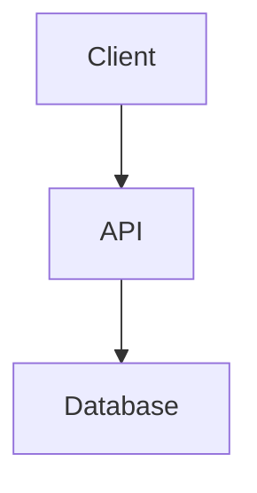

# 迁移指南:从传统设计到模块化结构

本指南帮助您将现有的单一 `design.md` 文件迁移到模块化设计结构。

## 目录

- [为什么要迁移](#为什么要迁移)
- [迁移前准备](#迁移前准备)
- [迁移方法](#迁移方法)
- [迁移后验证](#迁移后验证)
- [常见场景](#常见场景)
- [故障排除](#故障排除)

## 为什么要迁移

### 模块化设计的优势

如果您的项目符合以下情况,建议迁移:

✅ **设计文档过长** (超过 500 行)
- 单一文件难以导航和维护
- 模块化后每个文件更聚焦

✅ **多人协作**
- 不同团队成员可以并行审核不同模块
- 减少合并冲突

✅ **频繁更新设计**
- 只需重新生成受影响的模块
- 不影响其他稳定的设计部分

✅ **跨模块引用混乱**
- 模块化后可以使用交叉引用分析
- 自动检测不一致性

### 保持传统格式的情况

某些情况下,保持传统格式可能更合适:

❌ **简单项目** (设计文档少于 200 行)
- 迁移的收益不明显

❌ **设计已稳定**
- 不再频繁修改
- 迁移成本大于收益

❌ **单人维护**
- 不需要并行审核
- 传统格式已经足够

## 迁移前准备

### 1. 备份现有设计

在迁移前创建备份:

```bash
# 方法 1: 手动复制
cp .claude/specs/my-spec/design.md \
   .claude/specs/my-spec/design.md.manual-backup

# 方法 2: Git 提交
git add .claude/specs/my-spec/design.md
git commit -m "backup: save design before migration"
```

**注意**: 迁移工具会自动创建 `.backup` 文件,但手动备份更保险。

### 2. 检查设计文档结构

确保 `design.md` 使用标准 Markdown 格式:

**良好的结构** ✅:
```markdown
# Design: My Feature

## Frontend Design
### Component Architecture
...

## API Design
### Endpoints
...

## Database Design
### Models
...
```

**需要调整的结构** ⚠️:
```markdown
# Design

Frontend stuff...

API:
- endpoint 1
- endpoint 2

Database
Tables: User, Order, Product
```

**调整建议**:
- 使用 `##` 标题分隔主要部分
- 每个部分有清晰的标题
- 标题使用描述性名称(包含技术关键词)

### 3. 启用模块化设计

编辑 `.claude/settings/kfc-settings.json`:

```json
{
  "features": {
    "modularDesign": {
      "enabled": true,
      "showMigrationPrompt": true
    }
  }
}
```

### 4. 了解迁移过程

迁移工具会:
1. 分析 `design.md` 的章节结构
2. 根据章节标题猜测对应的模块类型
3. 显示映射预览供您确认
4. 创建模块文件并复制内容
5. 重命名原文件为 `design.md.backup`

## 迁移方法

### 方法 1: 自动迁移(推荐)

#### 步骤 1: 触发迁移

**通过通知**:
打开包含 `design.md` 的 spec 时,会显示通知:

```
检测到旧版设计文档
是否要迁移到模块化结构?

[迁移] [稍后] [不再提示]
```

点击 "迁移"。

**通过右键菜单**:
1. 在 Spec Explorer 中右键点击 spec
2. 选择 "迁移到模块化设计"

#### 步骤 2: 查看映射预览

系统显示章节到模块的映射:

```
检测到以下章节:

✓ Frontend Design → design-frontend.md
✓ API Design → design-server-api.md
✓ Business Logic → design-server-logic.md
✓ Database Schema → design-server-database.md
✓ Testing Strategy → design-testing.md

? 其他未映射的章节将被忽略

[确认迁移] [取消]
```

**检查映射是否正确**:
- 每个章节是否分配到合适的模块?
- 是否有重要内容被忽略?

如果映射不正确,点击 "取消" 并使用方法 2 手动迁移。

#### 步骤 3: 确认并执行

点击 "确认迁移",系统会:

1. 创建模块文件
2. 复制对应章节内容
3. 重命名原文件为 `design.md.backup`
4. 创建 `.module-metadata.json`
5. 刷新 TreeView

#### 步骤 4: 验证结果

检查新创建的模块文件:

```bash
.claude/specs/my-spec/
├── requirements.md
├── design.md.backup         # 原始文件备份
├── design-frontend.md       # 新模块
├── design-server-api.md
├── design-server-logic.md
├── design-server-database.md
├── design-testing.md
├── .module-metadata.json    # 模块状态
└── tasks.md
```

### 方法 2: 手动迁移

如果自动迁移的映射不正确,可以手动迁移:

#### 步骤 1: 创建模块文件

手动创建空的模块文件:

```bash
cd .claude/specs/my-spec

# 创建需要的模块
touch design-frontend.md
touch design-server-api.md
touch design-server-logic.md
touch design-server-database.md
touch design-testing.md
```

#### 步骤 2: 复制内容

打开 `design.md`,将相关章节复制到对应的模块文件:

**示例**:

从 `design.md` 中:
```markdown
## Frontend Architecture

### Components
- LoginForm
- Dashboard
- UserProfile

### State Management
Using Redux with the following slices:
- auth
- user
- notifications
```

复制到 `design-frontend.md`:
```markdown
# 前端设计

## 组件架构

### Components
- LoginForm
- Dashboard
- UserProfile

### State Management
Using Redux with the following slices:
- auth
- user
- notifications
```

**技巧**:
- 保持原有的标题层级
- 调整主标题为 `# 前端设计` 或 `# Frontend Design`
- 保留所有代码块、图表和格式

#### 步骤 3: 创建元数据文件

创建 `.module-metadata.json`:

```json
{
  "version": "1.0",
  "modules": {
    "frontend": {
      "workflowState": "pending-review",
      "generatedAt": "2025-10-14T10:00:00Z"
    },
    "server-api": {
      "workflowState": "pending-review",
      "generatedAt": "2025-10-14T10:00:00Z"
    },
    "server-logic": {
      "workflowState": "pending-review",
      "generatedAt": "2025-10-14T10:00:00Z"
    },
    "server-database": {
      "workflowState": "pending-review",
      "generatedAt": "2025-10-14T10:00:00Z"
    },
    "testing": {
      "workflowState": "pending-review",
      "generatedAt": "2025-10-14T10:00:00Z"
    }
  },
  "canProgressToTasks": false
}
```

#### 步骤 4: 备份原文件

```bash
mv design.md design.md.backup
```

#### 步骤 5: 刷新视图

在 Spec Explorer 中点击刷新按钮。

### 方法 3: 混合方法

结合自动和手动迁移:

1. 使用自动迁移创建基本结构
2. 手动调整映射不准确的部分
3. 补充遗漏的内容

## 迁移后验证

### 1. 文件完整性检查

确认所有模块文件已创建:

```bash
ls -la .claude/specs/my-spec/design-*.md
```

预期输出:
```
design-frontend.md
design-server-api.md
design-server-logic.md
design-server-database.md
design-testing.md
```

### 2. 内容完整性检查

对比总行数:

```bash
# 原始文件行数
wc -l .claude/specs/my-spec/design.md.backup

# 新模块总行数
wc -l .claude/specs/my-spec/design-*.md | tail -n 1
```

**注意**: 新模块可能增加了标题和格式,行数略有增加是正常的。

### 3. TreeView 检查

在 Spec Explorer 中验证:

```
SPEC
└─ my-spec
    ├─ 📄 requirements
    ├─ 📂 Design Modules
    │   ├─ 🌐 前端设计 [👁️ 待审核]
    │   ├─ 🔌 服务端 API [👁️ 待审核]
    │   ├─ ⚙️ 服务端逻辑 [👁️ 待审核]
    │   ├─ 🗄️ 数据库设计 [👁️ 待审核]
    │   └─ 🧪 测试设计 [👁️ 待审核]
    └─ 📋 tasks
```

所有模块应显示为 "待审核" 状态。

### 4. 内容质量检查

逐个打开模块文件,检查:

- [ ] 内容是否完整
- [ ] 格式是否正确(Markdown)
- [ ] 代码块是否保留
- [ ] 图表是否保留
- [ ] 链接是否有效

### 5. 交叉引用验证

运行交叉引用分析:

1. 右键点击 spec
2. 选择 "分析跨模块引用"
3. 检查是否有警告

**常见警告**:
- 前端引用的 API 端点未在 API 模块中定义
- API 使用的数据模型未在数据库模块中定义

**处理方法**:
- 如果是真实问题,补充设计内容
- 如果是误报,可以忽略

## 常见场景

### 场景 1: 前端 + 后端全栈项目

**原始 design.md 结构**:
```markdown
# Design: E-commerce Platform

## Overview
...

## Frontend Design
### React Components
...

## API Design
### REST Endpoints
...

## Database Schema
### Tables
...

## Testing
...
```

**迁移结果**:
```
design-frontend.md    ← Frontend Design
design-server-api.md  ← API Design
design-server-logic.md ← (可能需要手动添加)
design-server-database.md ← Database Schema
design-testing.md     ← Testing
```

**后续操作**:
1. 如果有业务逻辑设计,手动添加到 `design-server-logic.md`
2. 或者重新生成 Server Logic 模块

---

### 场景 2: 纯后端 API 服务

**原始 design.md 结构**:
```markdown
# Design: Payment Service

## API Specification
...

## Business Logic
...

## Data Models
...

## Error Handling
...

## Testing Strategy
...
```

**迁移结果**:
```
design-server-api.md     ← API Specification
design-server-logic.md   ← Business Logic, Error Handling
design-server-database.md ← Data Models
design-testing.md        ← Testing Strategy
```

**后续操作**:
- Frontend 和 Mobile 模块不会创建(正确行为)

---

### 场景 3: 包含自定义章节的设计

**原始 design.md 结构**:
```markdown
# Design: IoT Platform

## Frontend Dashboard
...

## Device Communication Protocol
...

## Cloud Services Integration
...

## Security Architecture
...

## Database Design
...
```

**迁移挑战**:
- "Device Communication Protocol" 和 "Cloud Services Integration" 不属于标准模块
- "Security Architecture" 需要自定义模块

**解决方案**:

**选项 1**: 将自定义章节合并到最相关的标准模块
```
design-frontend.md           ← Frontend Dashboard
design-server-logic.md       ← Device Protocol + Cloud Integration
design-server-database.md    ← Database Design
design-testing.md            ← 手动创建
```

然后在 `design-server-logic.md` 中添加额外的章节:
```markdown
# 服务端逻辑设计

## 设备通信协议
[从原设计复制]

## 云服务集成
[从原设计复制]

## 安全架构
[从原设计复制]
```

**选项 2**: 定义自定义模块(推荐)

在配置中添加:
```json
{
  "features": {
    "modularDesign": {
      "customModules": [
        {
          "type": "iot-protocol",
          "name": "IoT 协议设计",
          "fileName": "design-iot-protocol.md"
        },
        {
          "type": "security",
          "name": "安全设计",
          "fileName": "design-security.md"
        }
      ]
    }
  }
}
```

然后手动创建这些模块文件。

---

### 场景 4: 包含大量图表的设计

**原始 design.md** 包含:
- Mermaid 图表
- PlantUML 图表
- 嵌入的图片

**迁移注意事项**:

1. **Mermaid 代码块**:
   - 自动迁移会保留
   - 验证渲染是否正确

2. **图片链接**:
   - 相对路径: 需要检查是否仍然有效
   - 绝对路径: 通常不受影响

3. **外部图表工具**:
   - 如果使用外部工具(如 draw.io),链接可能失效
   - 建议使用 Mermaid 重绘图表

**示例修复**:

迁移前:
```markdown

```

迁移后(可能需要修复路径):
```markdown

```

或者使用 Mermaid:
```markdown

```

## 故障排除

### 问题 1: 迁移后 TreeView 不显示模块

**症状**:
- 模块文件已创建
- TreeView 仍显示旧结构或空白

**解决方案**:

```bash
# 1. 检查文件是否存在
ls -la .claude/specs/my-spec/design-*.md

# 2. 检查元数据文件
cat .claude/specs/my-spec/.module-metadata.json

# 3. 刷新缓存
# 在 VSCode 命令面板(Cmd+Shift+P)中:
# > Developer: Reload Window

# 4. 或删除缓存
rm -rf .claude/specs/my-spec/.module-cache
```

---

### 问题 2: 内容缺失或不完整

**症状**: 某些章节在迁移后消失

**原因**: 自动映射无法识别该章节

**解决方案**:

1. 查看 `design.md.backup`
2. 找到缺失的章节
3. 手动复制到相应的模块文件
4. 或创建自定义模块

---

### 问题 3: 映射错误

**症状**: 章节被分配到错误的模块

**示例**: "API Design" 被映射到 `design-frontend.md`

**解决方案**:

1. 恢复备份:
   ```bash
   mv design.md.backup design.md
   rm design-*.md .module-metadata.json
   ```

2. 调整 `design.md` 的章节标题:
   ```markdown
   # 修改前
   ## API

   # 修改后
   ## Server API Design
   ```

3. 重新运行迁移

---

### 问题 4: 格式损坏

**症状**: 代码块、表格或列表格式错乱

**原因**: Markdown 解析问题

**解决方案**:

手动修复格式:

```markdown
# 损坏的代码块
``` javascript
const x = 1;
```

# 修复后
```javascript
const x = 1;
```
```

确保:
- 代码块有正确的语言标识
- 表格有正确的列对齐
- 列表有正确的缩进

---

### 问题 5: 无法回滚

**症状**: 想要恢复到单一 `design.md` 格式

**解决方案**:

```bash
# 1. 恢复备份
cd .claude/specs/my-spec
mv design.md.backup design.md

# 2. 删除模块文件
rm design-frontend.md
rm design-server-*.md
rm design-testing.md
rm .module-metadata.json

# 3. 禁用模块化设计
# 编辑 .claude/settings/kfc-settings.json
{
  "features": {
    "modularDesign": {
      "enabled": false
    }
  }
}

# 4. 刷新视图
```

---

### 问题 6: 迁移后无法生成任务

**症状**: 所有模块已批准,但无法进入任务阶段

**解决方案**:

1. 检查元数据文件:
   ```bash
   cat .module-metadata.json
   ```

2. 确保所有模块状态为 "approved":
   ```json
   {
     "modules": {
       "frontend": { "workflowState": "approved" },
       "server-api": { "workflowState": "approved" },
       ...
     },
     "canProgressToTasks": true
   }
   ```

3. 如果 `canProgressToTasks` 为 `false`,手动修改为 `true`

4. 或者在 UI 中重新批准所有模块

## 最佳实践

### 1. 小步迁移

对于大型项目:
- 不要一次迁移所有 spec
- 先迁移一个测试 spec 验证流程
- 然后批量迁移其他 spec

### 2. 团队沟通

迁移前通知团队:
- 说明迁移计划和时间
- 确保没有人正在编辑 `design.md`
- 迁移后通知完成

### 3. 版本控制

```bash
# 迁移前
git add .
git commit -m "backup: before modular design migration"

# 迁移后
git add .
git commit -m "refactor: migrate to modular design structure"
```

### 4. 文档更新

更新项目文档说明新结构:

```markdown
# 设计文档结构(更新于 2025-10-14)

我们已迁移到模块化设计结构:

- 前端设计: `design-frontend.md`
- API 设计: `design-server-api.md`
- 数据库设计: `design-server-database.md`
- ...

旧版 `design.md` 已备份为 `design.md.backup`
```

### 5. 持续验证

迁移后定期检查:
- 内容是否完整
- 跨引用是否正确
- 团队成员是否理解新结构

## 自动化批量迁移

如果有多个 spec 需要迁移,可以编写脚本:

```bash
#!/bin/bash
# migrate-all-specs.sh

SPECS_DIR=".claude/specs"

for spec in "$SPECS_DIR"/*; do
  if [ -d "$spec" ] && [ -f "$spec/design.md" ]; then
    echo "Migrating $spec..."

    # 触发迁移(需要 VSCode 命令行扩展)
    code --command "kfc.spec.designModule.migrate" "$spec"

    # 或者使用 Claude CLI(如果有 API)
    # claude migrate-design "$spec"

    sleep 5  # 等待迁移完成
  fi
done

echo "Migration complete!"
```

**注意**: 目前没有命令行工具支持批量迁移,需要在 UI 中逐个迁移。

## 相关文档

- [模块化设计概述](./modular-design.md)
- [使用指南](./usage-guide.md)
- [配置指南](./configuration-guide.md)
- [自定义模块示例](./custom-modules-example.md)
